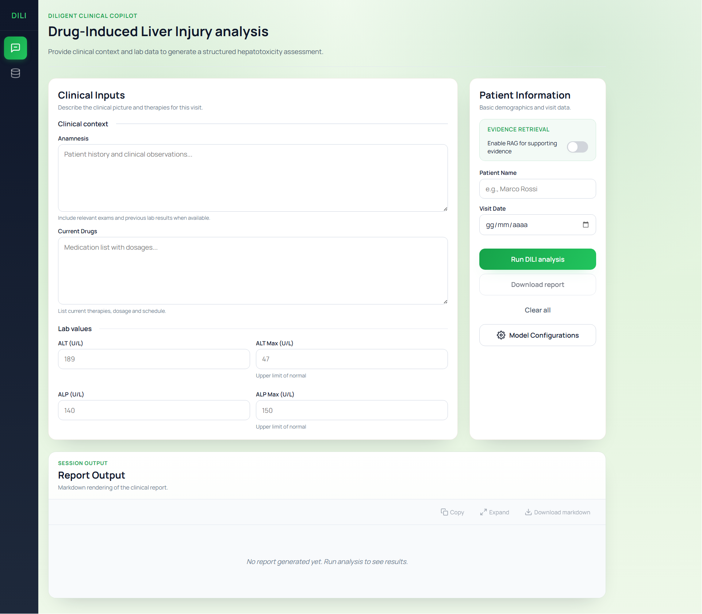

# DILIGENT Clinical Copilot

## 1. Project Overview
DILIGENT Clinical Copilot supports clinicians during Drug-Induced Liver Injury (DILI) evaluations with a FastAPI backend and a React + TypeScript (Vite) frontend. The frontend collects anamnesis, medications, and lab values, while the backend coordinates drug parsing and LLM-assisted clinical analysis. Optional Retrieval-Augmented Generation (RAG) grounds outputs on a local LiverTox archive, and sessions can be stored for review and auditing. The frontend consumes the backend API, which manages analysis, persistence, and integrations.


## 2. Installation

### 2.1 Windows (One Click Setup)
Windows setup is automated and portable. Launch `DILIGENT/start_on_windows.bat`; the launcher will:

1. Verify or download portable runtimes into the repository (first run only).
2. Install backend dependencies.
3. Install frontend dependencies and build the UI when needed.
4. Start the backend API and the UI server, then open the browser.

**First Run:** A few minutes while runtimes and dependencies download and the UI builds. Artifacts are reused on later runs.

**Subsequent Runs:** Skip downloads/builds unless missing; startup takes seconds.

> **Note:** The launcher keeps everything inside the repo folder without system-wide installs, and may stop any process currently using the configured backend/UI ports before starting.

### 2.2 macOS / Linux (Manual Setup)
**Prerequisites:**
- **Python 3.12**
- **Node.js 18+** and npm
- (Optional) Ollama running locally for on-prem models
- Cloud provider keys (OpenAI, Gemini) if you plan to use remote inference

**Setup Steps:**
1. Clone and enter the repo:
   ```bash
   git clone <repo-url>
   cd <repo-folder>
   ```
2. Backend:
   ```bash
   python -m venv .venv
   source .venv/bin/activate
   pip install --upgrade pip
   pip install -e .
   ```
3. Frontend:
   ```bash
   cd DILIGENT/client
   npm install
   cd ..
   ```
4. Configuration:
   - Copy `DILIGENT/resources/templates/.env` to `DILIGENT/settings/.env`, then set API keys and any host/port overrides.
   - Optionally create `DILIGENT/client/.env` and set `VITE_API_BASE_URL` if you are not relying on the Vite dev proxy.

## 3. How to Use

### 3.1 Windows
Run `DILIGENT/start_on_windows.bat`.

- **First run:** Downloads runtimes, installs dependencies, builds the UI, then starts backend and preview server.
- **Later runs:** Reuse cached runtimes/builds and launch immediately.

The browser opens to `http://127.0.0.1:7861`. API root: `http://127.0.0.1:8000`. Docs: `http://127.0.0.1:8000/docs`.

### 3.2 macOS / Linux
Backend:
```bash
source .venv/bin/activate
uvicorn DILIGENT.server.app:app --host 0.0.0.0 --port 8000
```

Frontend (development with proxy to backend):
```bash
cd DILIGENT/client
FASTAPI_HOST=127.0.0.1 FASTAPI_PORT=8000 npm run dev
```

Frontend (preview build):
```bash
cd DILIGENT/client
npm run build
npm run preview -- --host 0.0.0.0 --port 7861
```

UI: `http://localhost:5173` (dev) or `http://localhost:7861` (preview). Backend: `http://localhost:8000`. Docs: `http://localhost:8000/docs`.

### 3.3 Using the Application
- Enter anamnesis, exam notes, current medications, and ALT/ALP values.
- Choose inference path (Ollama or cloud), select parsing/clinical models, and toggle RAG for LiverTox-backed retrieval.
- Run the clinical analysis to parse medications and produce the consultation summary.
- Review/export the report; sessions and model choices can be persisted to the configured database (SQLite in embedded mode by default).

-  

-  

## 4. Setup and Maintenance
Run `DILIGENT/setup_and_maintenance.bat` to access setup and maintenance actions:

- **Remove logs** - clear `.log` files under `DILIGENT/resources/logs`.
- **Uninstall app** - remove local runtimes and build artifacts (uv, embedded Python, portable Node.js, `node_modules`, `dist`, `.venv`, `uv.lock`) while preserving folder scaffolding.
- **Initialize database** - create or reset the project database schema.
- **Update RxNav drugs catalog** - refresh the local drugs catalog from RxNav.
- **Update LiverTox data** - refresh the LiverTox dataset used for ingestion/RAG.
- **Vectorize RAG documents** - rebuild embeddings and the vector store for retrieval.

## 5. Resources
`DILIGENT/resources` aggregates runtime assets, datasets, and templates:

- **database:** embedded database and retrieval artifacts (e.g., `sqlite.db`, `documents/`, `sources/`, `vectors/`).
- **logs:** backend and background-task logs for troubleshooting.
- **models:** storage for local model artifacts (when used).
- **runtimes:** portable Python/uv/Node.js downloaded by the Windows launcher.
- **templates:** starter assets such as the `.env` scaffold, `database_backup.db`, and the LiverTox archive template.

## 6. Configuration
Backend configuration is defined in `DILIGENT/settings/server_configurations.json` and loaded by the API at startup. Runtime overrides and secrets are read from `DILIGENT/settings/.env`. Frontend configuration is read from `DILIGENT/client/.env` during development or build time.

| Variable | Description |
|----------|-------------|
| FASTAPI_HOST | Backend host used by the Windows launcher; defined in `DILIGENT/settings/.env`; default `127.0.0.1`. |
| FASTAPI_PORT | Backend port for uvicorn; defined in `DILIGENT/settings/.env`; default `8000`. |
| UI_HOST | Host for the Vite preview server; defined in `DILIGENT/settings/.env`; default `127.0.0.1`. |
| UI_PORT | Port for the Vite preview server; defined in `DILIGENT/settings/.env`; default `7861`. |
| RELOAD | Enables uvicorn reload when `true`; defined in `DILIGENT/settings/.env`; default `false`. |
| OPENAI_API_KEY | OpenAI API key (cloud inference); defined in `DILIGENT/settings/.env`; default empty. |
| GEMINI_API_KEY | Gemini API key (cloud inference); defined in `DILIGENT/settings/.env`; default empty. |
| MPLBACKEND | Matplotlib backend for background tasks; defined in `DILIGENT/settings/.env`; default `Agg`. |


## 7. License
Non-commercial use is covered by the Polyform Noncommercial License 1.0.0; commercial licensing is available separately. See `LICENSE` for full terms.
