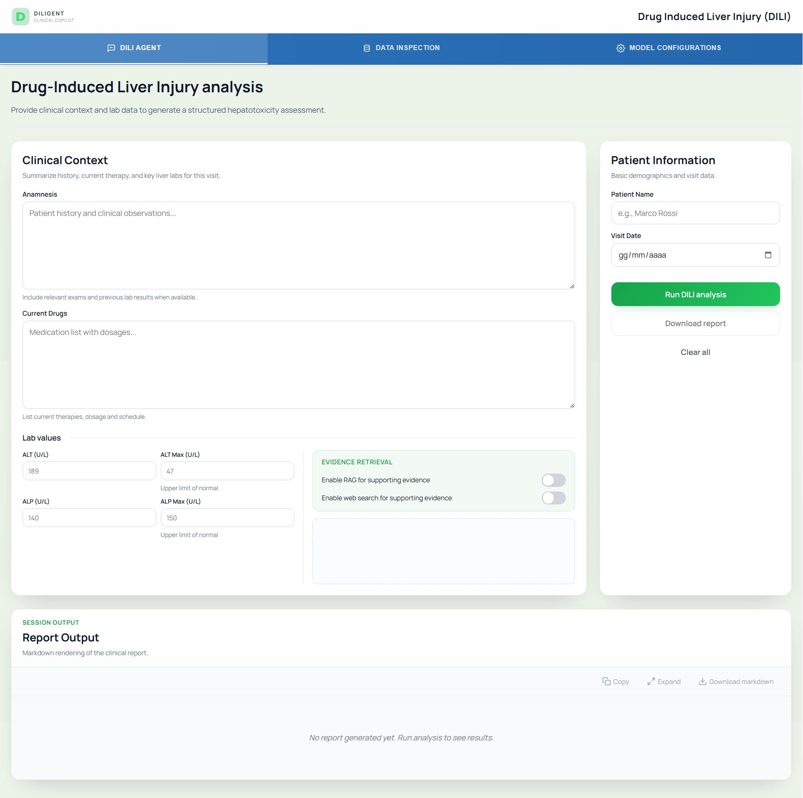
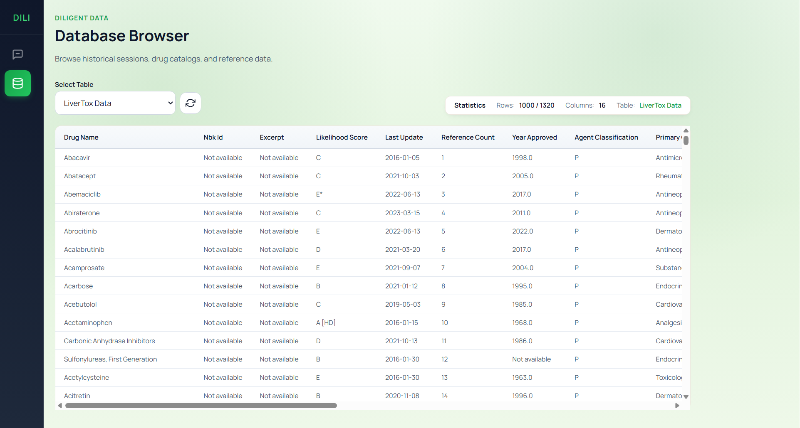

# DILIGENT Clinical Copilot

## 1. Project Overview
DILIGENT Clinical Copilot supports clinicians during Drug-Induced Liver Injury (DILI) evaluations with a FastAPI backend and a React + TypeScript (Vite) frontend. The frontend collects anamnesis, medications, and lab values, while the backend coordinates drug parsing and LLM-assisted clinical analysis. Optional Retrieval-Augmented Generation (RAG) grounds outputs on a local LiverTox archive, and sessions can be stored for review and auditing.

> **Work in Progress**: This project is still under active development. It will be updated regularly, but you may encounter bugs, issues, or incomplete features.

## 2. Dual-Mode Runtime Model
DILIGENT is configuration-first and uses one active runtime file: `DILIGENT/settings/.env`.

- Local mode is the default workflow for developers (no Docker required).
- Cloud mode is provided through Docker (`backend` + `frontend`) using the same `.env` contract.
- Mode switching is done by replacing `.env` values only.

Runtime profiles:
- `DILIGENT/settings/.env.local.example`
- `DILIGENT/settings/.env.cloud.example`
- Active runtime file: `DILIGENT/settings/.env`

Exact mode switch procedure:
```cmd
copy /Y DILIGENT\settings\.env.local.example DILIGENT\settings\.env
```
or
```cmd
copy /Y DILIGENT\settings\.env.cloud.example DILIGENT\settings\.env
```

Detailed packaging notes: `docs/PACKAGING_AND_RUNTIME_MODES.md`.

## 3. Local Mode (Default)

### 3.1 Windows (One-Click Setup)
Run:
```cmd
DILIGENT\start_on_windows.bat
```

The launcher will:
1. Verify or download portable runtimes into the repository (first run only).
2. Install backend dependencies with `uv`.
3. Install frontend dependencies (`npm ci` when lockfile exists, fallback `npm install`).
4. Build frontend when needed and start backend/frontend.

### 3.2 macOS / Linux (Manual)
Prerequisites:
- Python 3.14+
- Node.js 18+ and npm

Backend:
```bash
python -m venv .venv
source .venv/bin/activate
pip install --upgrade pip
pip install -e .
uvicorn DILIGENT.server.app:app --host 127.0.0.1 --port 8000
```

Frontend:
```bash
cd DILIGENT/client
npm install
npm run build
npm run preview -- --host 127.0.0.1 --port 7861
```

## 4. Cloud Mode (Docker)
1. Activate cloud profile:
```cmd
copy /Y DILIGENT\settings\.env.cloud.example DILIGENT\settings\.env
```
2. Build images:
```cmd
docker compose --env-file DILIGENT/settings/.env build --no-cache
```
3. Start:
```cmd
docker compose --env-file DILIGENT/settings/.env up -d
```
4. Stop:
```cmd
docker compose --env-file DILIGENT/settings/.env down
```

Cloud topology:
- `backend`: FastAPI/Uvicorn container on internal port `8000`.
- `frontend`: Nginx static hosting.
- Frontend proxies `/api` to `backend:8000` for same-origin API calls.

## 5. Deterministic Dependencies
- Backend is lockfile-backed by `uv.lock` and installed with `uv sync --frozen` in Docker.
- Frontend is lockfile-backed by `DILIGENT/client/package-lock.json` and installed with `npm ci` in Docker.
- Docker base images are pinned in `docker/backend.Dockerfile` and `docker/frontend.Dockerfile`.

## 6. Using the Application
- Enter anamnesis, exam notes, current medications, and ALT/ALP values.
- Choose inference path (Ollama or cloud), select parsing/clinical models, and toggle RAG.
- Run the analysis and review/export the report.

- 
- 

## 7. Configuration Reference
Runtime values are read from `DILIGENT/settings/.env`.

| Variable | Description |
|---|---|
| `FASTAPI_HOST`, `FASTAPI_PORT` | Backend host/port. |
| `UI_HOST`, `UI_PORT` | Frontend host/port (local preview, cloud publish port). |
| `VITE_API_BASE_URL` | Frontend API base path (`/api` recommended). |
| `RELOAD` | Enables uvicorn reload when `true`. |
| `DB_EMBEDDED` | `true` uses embedded SQLite; `false` enables external DB settings. |
| `DB_ENGINE`, `DB_HOST`, `DB_PORT`, `DB_NAME`, `DB_USER`, `DB_PASSWORD` | External DB connection settings. |
| `DB_SSL`, `DB_SSL_CA` | External DB TLS settings. |
| `DB_CONNECT_TIMEOUT`, `DB_INSERT_BATCH_SIZE` | DB runtime tuning settings. |
| `OPTIONAL_DEPENDENCIES` | Enables optional launcher dependency installation path. |
| `MPLBACKEND`, `KERAS_BACKEND` | Runtime plotting/ML backend settings. |
| `OPENAI_API_KEY`, `GEMINI_API_KEY` | Cloud provider API keys. |

## 8. Setup and Maintenance
Run `DILIGENT/setup_and_maintenance.bat` for maintenance operations:
- Remove logs
- Uninstall app (local runtimes/artifacts)
- Initialize database
- Update RxNav catalog
- Update LiverTox data
- Vectorize RAG documents

## 9. License
Non-commercial use is covered by the Polyform Noncommercial License 1.0.0; commercial licensing is available separately. See `LICENSE`.
