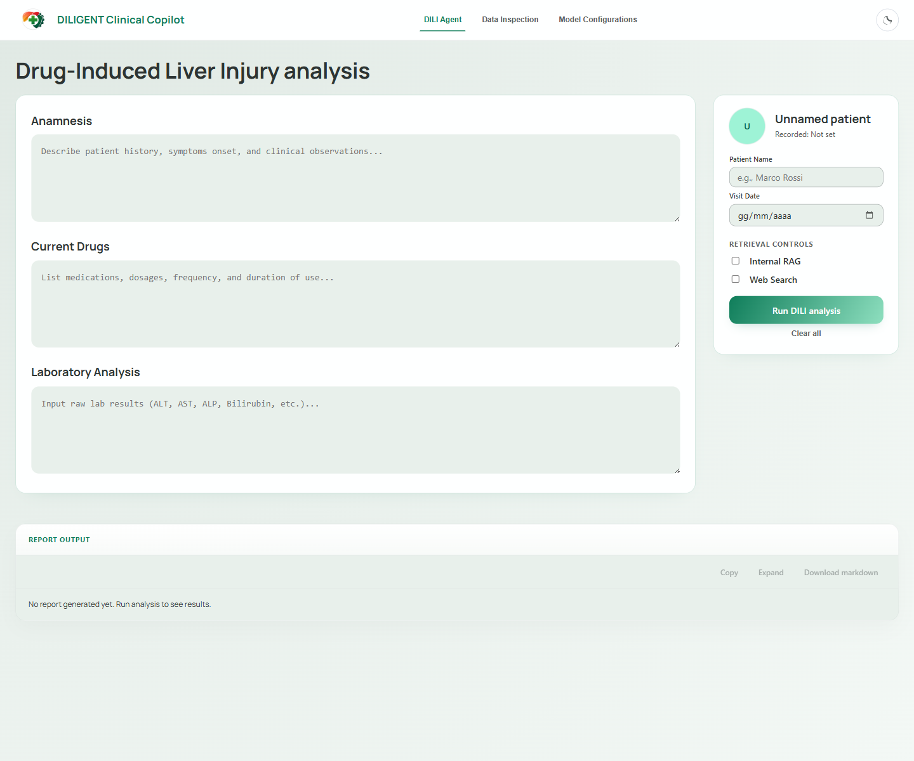
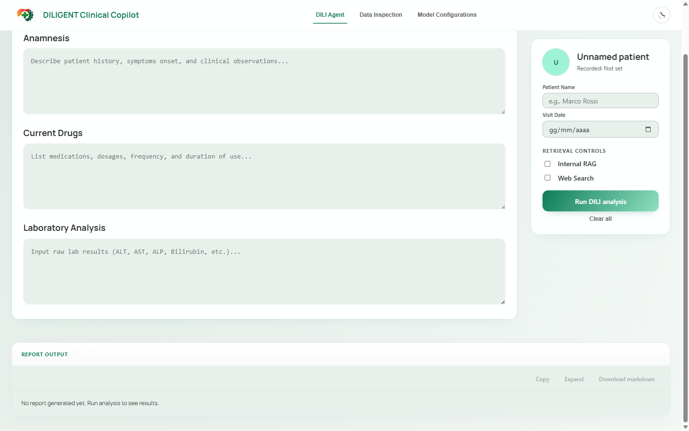
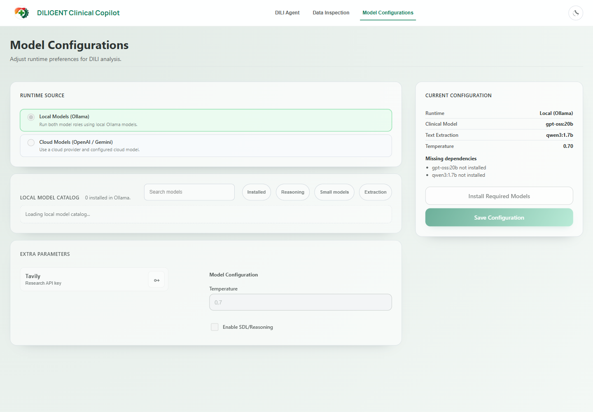
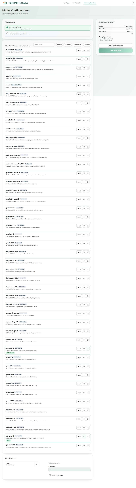
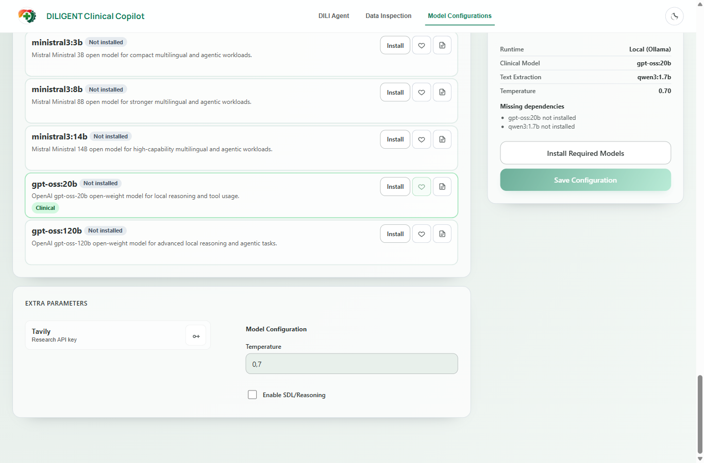
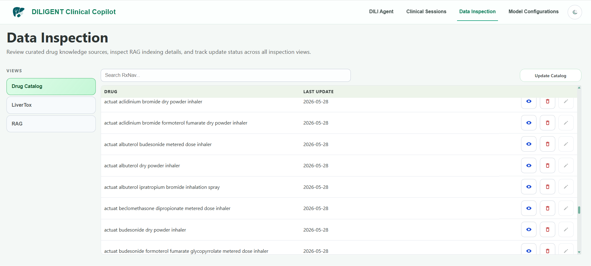

# DILIGENT Clinical Copilot

## 1. Project Overview
DILIGENT Clinical Copilot supports clinicians during Drug-Induced Liver Injury (DILI) evaluations with a FastAPI backend and a React + TypeScript (Vite) frontend. The frontend collects anamnesis, medications, and lab values, while the backend coordinates drug parsing and LLM-assisted clinical analysis. Optional Retrieval-Augmented Generation (RAG) grounds outputs on a local LiverTox archive, and sessions can be stored for review and auditing.

> **Work in Progress**: This project is still under active development. It will be updated regularly, but you may encounter bugs, issues, or incomplete features.

## 2. Runtime Model
DILIGENT is configuration-first and uses one active runtime file: `DILIGENT/settings/.env`.

- Local mode is the default workflow for developers.
- Cloud-hardened API mode is enabled through `.env` settings only (no bundled container orchestration).
- Packaged desktop mode uses Tauri with a local Python backend started by the desktop shell.
- Mode switching is done by replacing `.env` values only.

Runtime profiles:
- `DILIGENT/settings/.env.local.example`
- `DILIGENT/settings/.env.cloud.example`
- `DILIGENT/settings/.env.local.tauri.example`
- Active runtime file: `DILIGENT/settings/.env`

Exact mode switch procedure:
```cmd
copy /Y DILIGENT\settings\.env.local.example DILIGENT\settings\.env
```
or
```cmd
copy /Y DILIGENT\settings\.env.cloud.example DILIGENT\settings\.env
```
or
```cmd
copy /Y DILIGENT\settings\.env.local.tauri.example DILIGENT\settings\.env
```

Detailed packaging notes: `assets/docs/PACKAGING_AND_RUNTIME_MODES.md`.

## 3. Local Mode (Default)

### 3.1 Windows (One-Click Setup)
Run:
```cmd
DILIGENT\start_on_windows.bat
```

The launcher will:
1. Verify or download portable runtimes into the repository (first run only).
2. Install backend dependencies with `uv`.
3. Install frontend dependencies (`npm ci` when lockfile exists, fallback `npm install`).
4. Build frontend when needed and start backend/frontend.

### 3.2 macOS / Linux (Manual)
Prerequisites:
- Python 3.14+
- Node.js 18+ and npm

Backend:
```bash
python -m venv runtimes/.venv
source runtimes/.venv/bin/activate
pip install --upgrade pip
pip install -e .
uvicorn DILIGENT.server.app:app --host 127.0.0.1 --port 8000
```

Frontend:
```bash
cd DILIGENT/client
npm install
npm run build
npm run preview -- --host 127.0.0.1 --port 7861
```

## 4. Cloud-Hardened API Mode
Activate cloud profile:
```cmd
copy /Y DILIGENT\settings\.env.cloud.example DILIGENT\settings\.env
```

This profile enables backend cloud-hardening behavior (for example restricting docs and mirrored routes). Deployment topology is owned externally (for example VM, PaaS, or reverse proxy), and this repository no longer ships bundled container artifacts.

## 5. Packaged Desktop Mode (Tauri)
Prepare the desktop profile:
```cmd
copy /Y DILIGENT\settings\.env.local.tauri.example DILIGENT\settings\.env
```

Ensure the portable build runtimes are present:
```cmd
DILIGENT\start_on_windows.bat
```

Required root runtime layout:
- `runtimes/python/python.exe`
- `runtimes/uv/uv.exe`
- `runtimes/nodejs/node.exe`
- `runtimes/nodejs/npm.cmd`
- `runtimes/.venv`
- `runtimes/uv.lock`

Rust prerequisite for Tauri packaging (build machines):
- Install Rust via `rustup` (`https://rustup.rs/`).
- Ensure a default toolchain is configured (for example `stable-x86_64-pc-windows-msvc`).

Build the Windows desktop artifacts:
```cmd
release\tauri\build_with_tauri.bat
```

Public outputs are exported to:
- `release/windows/installers`
- `release/windows/portable`

Regenerate desktop icon assets from the shared web favicon source:
```cmd
cd DILIGENT\client
npm run tauri:icon
```

Clean previous desktop build outputs:
```cmd
cd DILIGENT\client
npm run tauri:clean
```

## 6. Deterministic Dependencies
- Backend is lockfile-backed by `runtimes/uv.lock` and installed with `uv sync --frozen`.
- Frontend is lockfile-backed by `DILIGENT/client/package-lock.json` and installed with `npm ci`.

## 7. Using the Application
- Enter anamnesis, exam notes, current medications, and ALT/ALP values.
- Choose inference path (Ollama or cloud), select parsing/clinical models, and toggle RAG.
- Run the analysis and review/export the report.

### Screenshots

#### Landing Page


#### Dashboard / Report Output


#### Model Configuration (Settings)


#### Local Model Catalog (List)


#### Provider Access Key (Detail Modal)


#### Data Inspection


## 8. Configuration Reference
Runtime values are read from `DILIGENT/settings/.env`.

| Variable | Description |
|---|---|
| `FASTAPI_HOST`, `FASTAPI_PORT` | Backend host/port. |
| `UI_HOST`, `UI_PORT` | Frontend host/port (local preview, cloud publish port). |
| `VITE_API_BASE_URL` | Frontend API base path (`/api` recommended). |
| `RELOAD` | Enables uvicorn reload when `true`. |
| `DB_EMBEDDED` | `true` uses embedded SQLite; `false` enables external DB settings. |
| `DB_ENGINE`, `DB_HOST`, `DB_PORT`, `DB_NAME`, `DB_USER`, `DB_PASSWORD` | External DB connection settings. |
| `DB_SSL`, `DB_SSL_CA` | External DB TLS settings. |
| `DB_CONNECT_TIMEOUT`, `DB_INSERT_BATCH_SIZE` | DB runtime tuning settings. |
| `OPTIONAL_DEPENDENCIES` | Enables optional launcher dependency installation path. |
| `MPLBACKEND`, `KERAS_BACKEND` | Runtime plotting/ML backend settings. |
| `OPENAI_API_KEY`, `GEMINI_API_KEY` | Cloud provider API keys. |

## 9. Setup and Maintenance
Run `DILIGENT/setup_and_maintenance.bat` for offline maintenance operations only:
- Initialize database
- Remove logs
- Clean desktop build artifacts
- Uninstall app (local runtimes/artifacts)

Dataset and indexing updates are owned by the Data Inspection UI:
- RxNav update wizard
- LiverTox update wizard
- RAG embeddings update wizard (in the RAG inspection view)

## 10. License
Non-commercial use is covered by the Polyform Noncommercial License 1.0.0; commercial licensing is available separately. See `LICENSE`.


