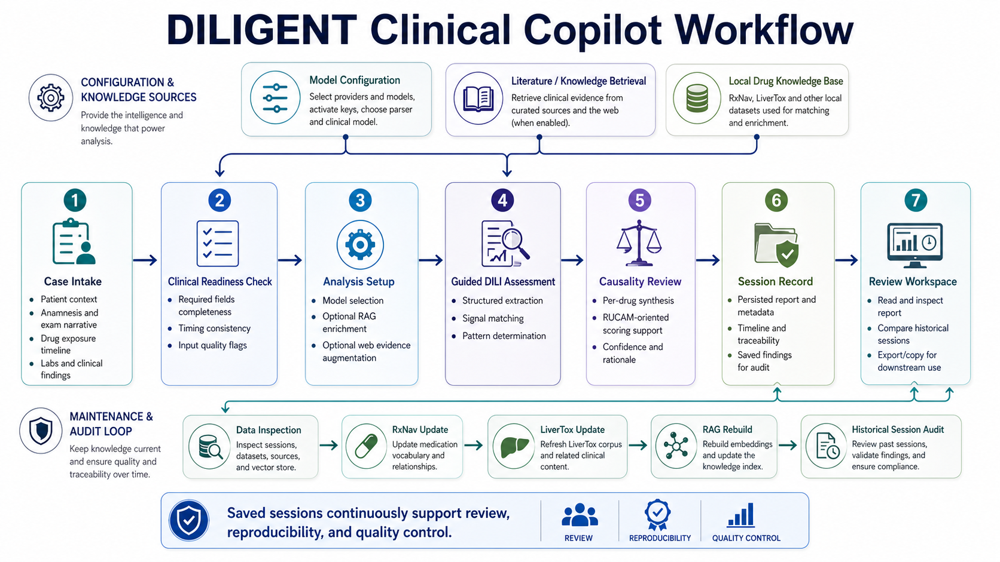
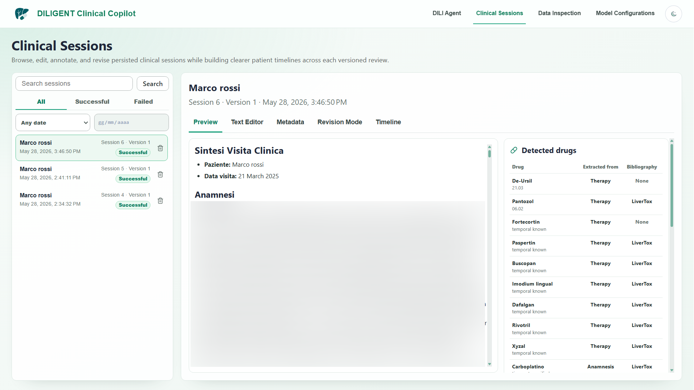

# DILIGENT Clinical Copilot

[](https://github.com/CTCycle/DILIGENT-Clinical-Copilot/releases) [](./app/server/pyproject.toml) [](./app/client/package.json) [](./LICENSE) [](https://github.com/CTCycle/DILIGENT-Clinical-Copilot/actions/workflows/ci.yml)

## 1. Project Overview
DILIGENT Clinical Copilot supports clinicians during Drug-Induced Liver Injury (DILI) evaluations with a FastAPI backend and an Angular + TypeScript frontend. It collects anamnesis, medications, and lab values, then coordinates clinical analysis with optional RAG support and session persistence for review.

> **Work in Progress**: This project is under active development and may contain incomplete features or defects.


_Conceptual flow from case intake through guided DILI analysis, session recording, and review._

## 2. Quick Start

### 2.1 Windows (Recommended)
Run:
```cmd
start_on_windows.bat
```

The launcher prepares local runtimes/dependencies and starts backend plus frontend.

### 2.2 macOS / Linux (Manual)
Prerequisites:
- Python 3.14+
- Node.js 18+ and npm

Backend:
```bash
cd app/server
python -m pip install -e ".[test]"
uvicorn app:app --host 127.0.0.1 --port 8000
```

Frontend:
```bash
cd app/client
npm install
npm run build
npm run preview -- --host 127.0.0.1 --port 7861
```

## 3. Runtime Profiles
DILIGENT is configuration-first and uses one active runtime file: `settings/.env`.

Switch to local profile:
```cmd
copy /Y settings\.env.local.example settings\.env
```

Switch to local Tauri profile:
```cmd
copy /Y settings\.env.local.tauri.example settings\.env
```

See `assets/docs/RUNTIME_MODES.md` for full runtime and packaging details.

## 4. Using the Application
Typical workflow:
1. Enter anamnesis, exam notes, medications, and lab values.
2. Choose model/provider settings and optionally enable RAG/web search.
3. Run analysis and review the generated report.
4. Use Data Inspection to explore current knowledge base.
5. Explore past sessions to modify and revise them.

Detailed user journeys and feature guidance are documented in `assets/docs/USER_MANUAL.md`.

### Screenshots

#### Dashboard / Report Output

_Analysis dashboard focused on the report output area and execution controls._

#### Sessions overview

_Explore past sessions and improve DILI assessment iteratively._

#### Model Configuration (Settings)

_Runtime source selection and current model configuration summary._

#### Data Inspection

_Session inspection table with status, timing, and record actions._

## 5. Desktop Packaging (Tauri)
Build Windows desktop artifacts:
```cmd
release\tauri\build_with_tauri.bat
```

Generated outputs:
- `release/windows/installers`
- `release/windows/portable`

## 6. Setup and Maintenance
Run:
```cmd
setup_and_maintenance.bat
```

Use this script for offline maintenance operations (for example DB initialization and cleanup tasks).

### 6.1 Regression Validation Shortcuts

From repository root:

```cmd
app\tests\run_tests.bat modelconfig
app\tests\run_tests.bat modelconfigfull
```

- `modelconfig`: validated regression slice (model-config unit + focused model-config/app-flow e2e checks, including conflict-feedback handling)
- `modelconfigfull`: model-config unit + full `test_app_flow.py` + `test_model_config_api.py`
  - If `uv --with pytest-playwright` cannot access package indexes on first use, run the PowerShell runner directly after cache warmup.

Equivalent PowerShell runners:

```powershell
.\app\tests\run_model_config_regression.ps1
.\app\tests\run_model_config_full_regression.ps1
```

## 7. Database and Ollama Requirements
- Database schemas are not upgraded in place across this cleanup; recreate the schema (or local SQLite DB file) when upgrading.
- Runtime startup does not perform SQLite schema salvage/deletion.
- Ollama must support the chat-capable `/api/chat` API; `/api/generate` fallback behavior has been removed.

## 8. Documentation Map
- `assets/docs/USER_MANUAL.md`: end-user operation, journeys, key commands.
- `assets/docs/ARCHITECTURE.md`: system boundaries and data flow.
- `assets/docs/BACKGROUND_JOBS.md`: job lifecycle and semantics.
- `assets/docs/RUNTIME_MODES.md`: runtime profiles and packaging.
- `assets/docs/ERROR_HANDLING.md`: backend/frontend error strategy.
- `assets/docs/UI_STANDARDS.md`: frontend design standards.

## 9. License
Non-commercial use is covered by the Polyform Noncommercial License 1.0.0; commercial licensing is available separately. See `LICENSE`.


