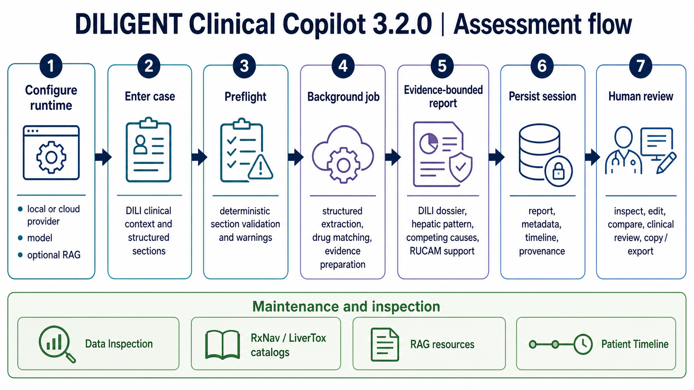
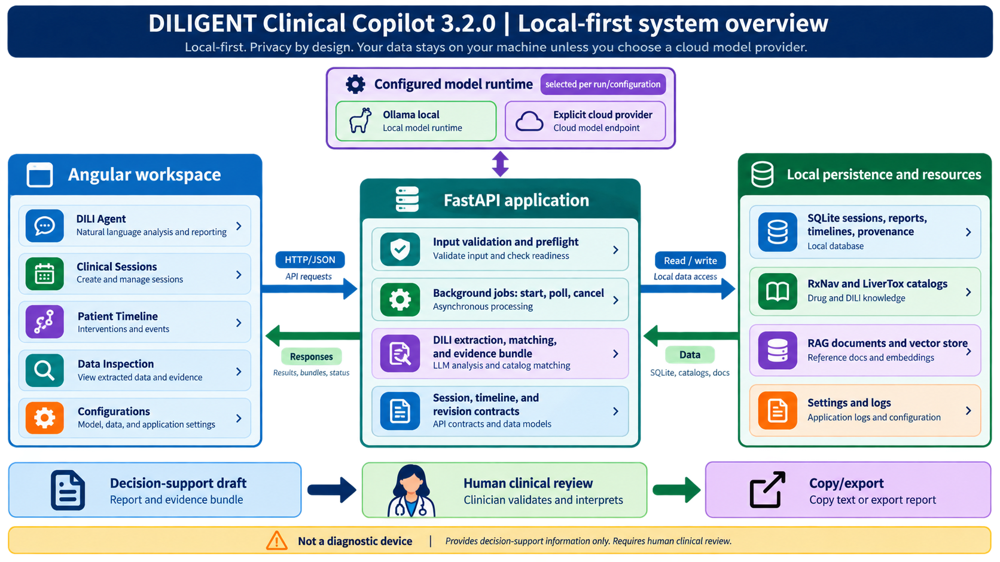
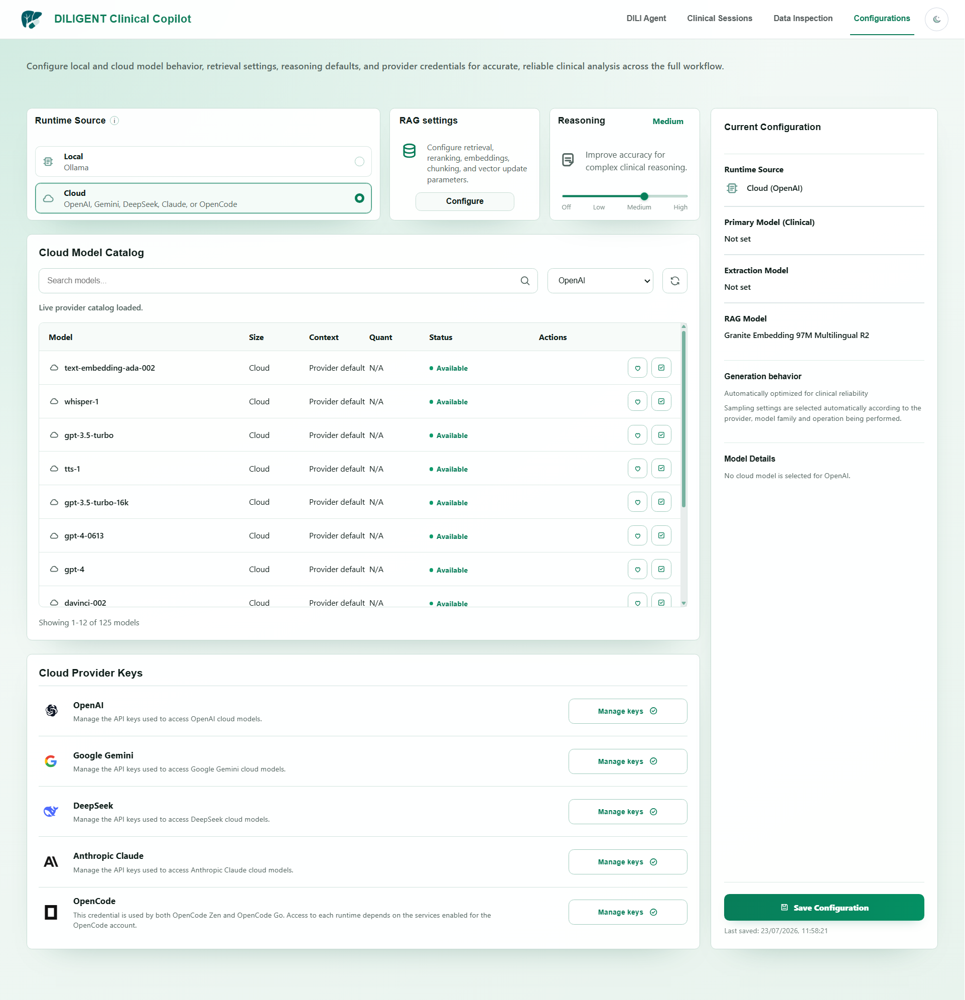
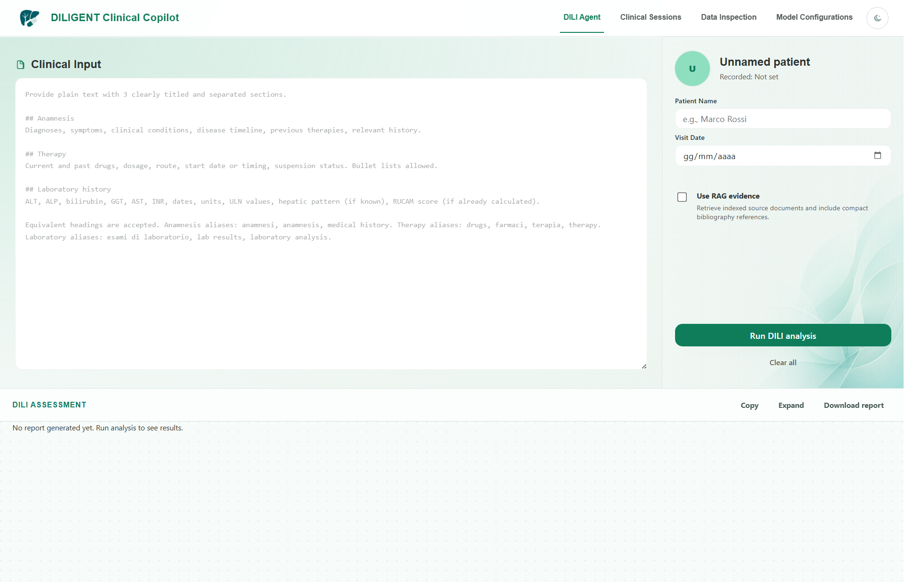
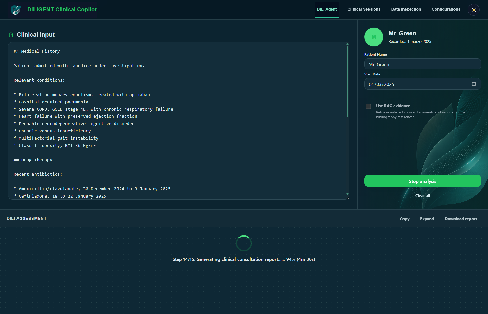
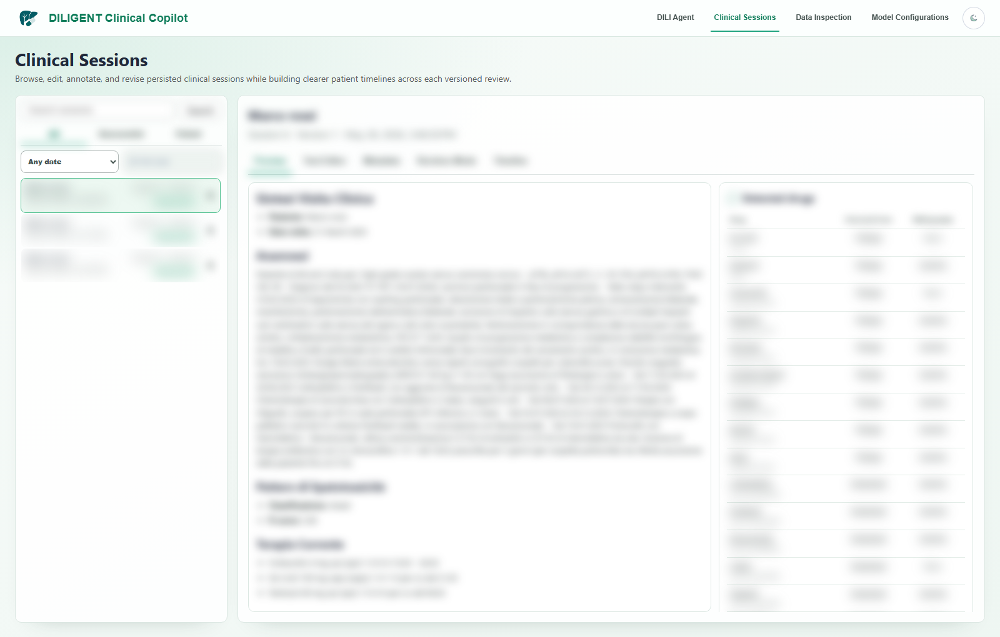
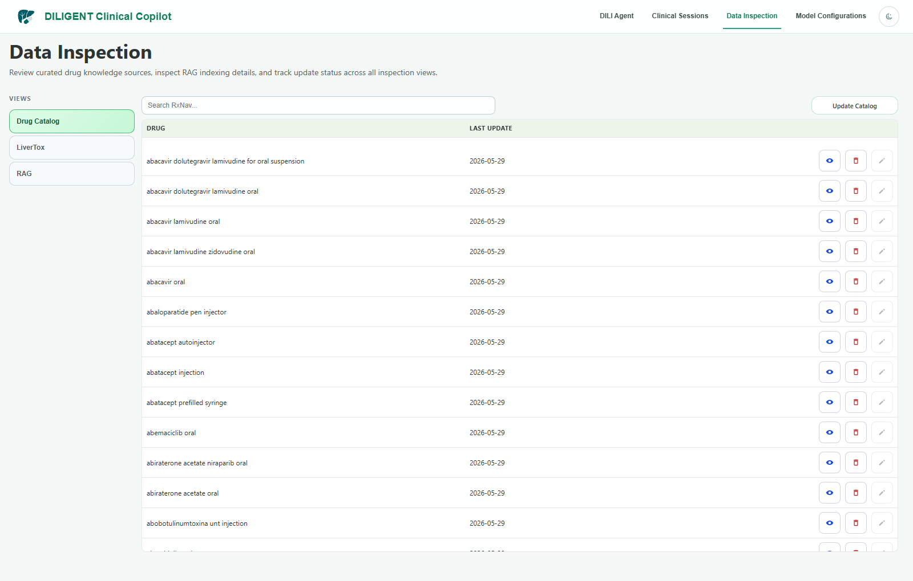

# DILIGENT Clinical Copilot
Last updated: 2026-08-21

[](https://github.com/CTCycle/DILIGENT-Clinical-Copilot/releases) [](./app/server/pyproject.toml) [](./app/client/package.json) [](./LICENSE) [](https://github.com/CTCycle/DILIGENT-Clinical-Copilot/actions/workflows/ci.yml?query=branch%3Adevelop)
[](https://ctcycle.github.io/CTCycle/)

DILIGENT Clinical Copilot is a local, single-user decision-support application for structured Drug-Induced Liver Injury (DILI) evaluation. It combines a FastAPI backend with an Angular interface to collect clinical context, validate it before analysis, coordinate configured language-model services, and preserve sessions for subsequent review.

It is a clinical-support tool, not a diagnostic device. A qualified clinician remains responsible for checking every input, output, conclusion, and use of any generated text.

## Architecture and maintenance documentation

The [documentation index](assets/docs/project_index.md) is the entry point for
the maintained architecture and runtime notes. The most relevant architecture
documents are the [system overview](assets/docs/architecture/system_overview.md),
[backend layers](assets/docs/architecture/backend_layers.md),
[persistence model](assets/docs/architecture/persistence.md),
[background jobs](assets/docs/architecture/background_jobs.md), and
[DILI pipeline](assets/docs/architecture/dili_assessment_pipeline.md).


_The 3.3.0 flow runs deterministic preflight and a polled background job, persists an evidence-bounded session, and ends with human review._


_The current system keeps the Angular workspace, FastAPI contracts, local persistence, configured model runtime, and human-review boundary explicit._

## What DILIGENT helps with

- Capture a DILI-focused clinical narrative, medication exposure, laboratory data, symptoms, and timing information in one structured request.
- Run pre-flight validation before starting an assessment, so incomplete sections and blocking input issues can be corrected early.
- Produce a DILI-oriented decision-support draft through the selected local or cloud model configuration, with optional retrieval-augmented evidence when available.
- Review clinical reasoning alongside structured output such as exposure and laboratory timelines, liver-pattern information, competing-cause states, and drug-match review flags.
- Save completed work as clinical sessions, edit report text directly, compare official revisions, and record human-review status.
- Inspect locally available datasets and resource status through Data Inspection.
- Review patient chronology in Patient Timeline and use it to refine later assessments.

The application deliberately distinguishes model-generated suggestions from persisted, backend-confirmed evidence. Treat all generated clinical text as a draft requiring clinical review.

## v3.3.0 release highlights

The v3.3.0 release hardens the Windows desktop package with deterministic runtime assembly, authenticated loopback access, single-instance behavior, graceful shutdown, and reproducible toolchain/version gates.

## Before you use it

Use DILIGENT only in a locally approved environment. In particular:

- Confirm your organisation's policy before entering protected health information.
- Cloud-backed runs can send clinical text to an external provider. Do not use real patient information with a cloud provider unless that transfer is explicitly authorised.
- Check the selected provider, model, active access key, and retrieval setting before each assessment.
- Verify drug names, dates, doses, laboratory values, units, alternative causes, and conclusions before relying on a report.

The supported deployment profile is local, single-user operation. Network deployment without access control is not supported.

## Get the source release

Download `DILIGENT-Clinical-Copilot-3.3.0.zip` from the [v3.3.0 GitHub release](https://github.com/CTCycle/DILIGENT-Clinical-Copilot/releases/tag/v3.3.0), extract it, and follow the source-startup instructions below.

The source archive contains the verified repository at the release commit. It is intended for development and local launcher-based operation; it is separate from the Windows desktop packages.

## Windows desktop release

The v3.3.0 release also publishes these Windows x64 desktop artifacts:

```text
release/DILIGENT-v3.3.0-windows-x64-portable.exe
release/DILIGENT-v3.3.0-windows-x64.msi
```

The portable executable is a single-file Tauri application. It does not require a separate Python, Node.js, Rust, npm, uv, or source checkout on the target machine. On first launch it verifies and extracts the embedded PyInstaller backend and Angular assets under `%LOCALAPPDATA%\DILIGENT\runtime\<version>\<payload-sha256>`, starts the backend on a random localhost port, and opens the desktop window. User settings, database, logs, models, source documents, vectors, exports, state, and access-key material remain under `%LOCALAPPDATA%\DILIGENT\data`.

The MSI installs the same Tauri shell and packaged runtime. It may use the configured WebView2 bootstrapper; an offline WebView2 installer is available only when the maintainer builds with `-OfflineWebView2`. The build also generates `release/DILIGENT-v3.3.0-windows-x64.sha256`, which is published with the portable EXE and MSI.

To use the published desktop build, download the portable EXE for no-install use or the MSI for an installed shortcut. Desktop startup does not use the development ports `7690` and `9847`.

For maintainers building a release on Windows x64:

```powershell
.\start_on_windows.ps1 -Action BuildDesktopRelease -Version 3.3.0 -DesktopTarget All -Force
```

Use `-DesktopTarget Portable` or `-DesktopTarget Msi` for one artifact. Release builds require a Windows x64 host and a clean worktree unless `-AllowDirtyTree` is supplied explicitly. Add `-OfflineWebView2` only when building an MSI that must install WebView2 without network access. Pushing a `vX.Y.Z` tag runs the Windows packaging workflow in `.github/workflows/release.yml`, which attaches the portable EXE and MSI to the matching GitHub Release. See [desktop release documentation](assets/docs/runtime/desktop_release.md) for the build pipeline, artifact validation, runtime layout, and cleanup.

## Start the application

### Windows

For the packaged desktop release, open the downloaded portable EXE or launch the installed MSI application. The Tauri shell performs runtime extraction and backend health checks before showing the window; no PowerShell launcher or development server is required.

For source/development operation, open PowerShell in the extracted repository folder and run:

```powershell
.\start_on_windows.ps1
```

The launcher prepares the project runtimes and dependencies, starts the backend and frontend, and offers grouped source-control, setup, data-cleanup, and desktop-release actions. On the first launch it creates `settings/.env` from `settings/.env.example` when necessary.

On a fresh checkout, select option 4 first to install dependencies and build the frontend, then select option 1 to launch the application. Use option 5 when the frontend needs to be rebuilt without synchronizing the backend environment. Option 2 checks `origin/main` without changing the checkout; option 3 pulls `origin/main` into the current checkout. Option 10 permanently removes local user data while preserving tracked application files. If option 1 detects missing or unusable dependencies or frontend output, it performs the same recovery build before launching.

When startup finishes, open the local UI at `http://127.0.0.1:9847`. If the page reports that the backend is unavailable, check `http://127.0.0.1:7690/api/health` first.

### macOS and Linux

Manual startup requires Python 3.14, Node.js, npm, and uv. From the repository root:

```bash
cd app/server
uv sync --locked --all-extras
uvicorn app:app --host 127.0.0.1 --port 7690
```

In a second terminal:

```bash
cd app/client
npm install
npm run build
npm run preview -- --host 127.0.0.1 --port 9847 --strictPort
```

The default endpoints are:

- UI: `http://127.0.0.1:9847`
- API health check: `http://127.0.0.1:7690/api/health`

If you change ports or related runtime settings, update `settings/.env` and restart both processes so they use the same configuration.

## Configure models and access keys

Open **Configurations** from the sidebar before starting an assessment.

1. Choose whether the assessment will use a local or cloud provider.
2. Choose compatible models for the clinical and text-extraction roles.
3. Save the configuration.
4. If the provider needs credentials, add and activate the appropriate access key.
5. Confirm the selected runtime is shown as valid before returning to the DILI Agent.

For local use, DILIGENT works with chat-capable Ollama models. Ollama must expose `/api/chat`; older `/api/generate` fallback behaviour is not supported. For cloud use, the active provider key is used to load its model catalog. The interface displays key fingerprints and metadata rather than the secret after it is saved.

Changing between local and cloud modes requires compatible model roles. The application rejects a configuration that persists cloud-only models under local mode, preventing the model-role mismatch that would otherwise fail later during report generation.


_Configurations brings runtime selection, RAG settings, model catalogs, and provider keys into one workspace._

## Run a DILI assessment

Open **DILI Agent** and enter a concise but complete case description. Useful input normally includes:

- case or patient identifier appropriate to your local policy
- suspected drug or exposure, dose, and timing
- symptom onset and relevant history
- liver laboratory values with units and reference limits when available
- concomitant medication and relevant competing causes
- the clinical question you want the assessment to address

For example:

```text
Suspected medication: ExampleDrug, started 21 days before enzyme rise
Symptoms: fatigue and jaundice
Labs: ALT 820 U/L (ULN 50), AST 610 U/L, ALP 160 U/L (ULN 120), bilirubin 3.2 mg/dL
Relevant context: no known viral hepatitis in the available record
Clinical question: assess whether the pattern is compatible with DILI
```

Then:

1. Select the configured provider or providers and choose whether to use retrieval support.
2. Start the run.
3. Read the pre-flight feedback. Correct blocking items before proceeding; warnings can be acknowledged only when their limitations are understood.
4. Wait for the progress indicator. You may navigate away and return while a process-local job is still running.
5. Review the completed report and its structured evidence before copying or exporting anything.

**Run without RAG** applies only to the current assessment. It does not alter the saved retrieval preference for later work. If evidence preparation is unavailable or exceeds its limit, DILIGENT continues without that prepared evidence and reports the limitation for review.

## Review the result

The generated report is a starting point for clinical review. Check it against the source record, especially:

- exposure chronology, dose changes, dechallenge, and rechallenge details
- laboratory values, units, and the liver-chemistry pattern
- alternative and competing causes
- causal statements that need supporting evidence
- matched-drug identity and any ambiguity flags
- missing data, assumptions, placeholders, and unsupported claims

The structured assessment retains details such as longitudinal events, Hy's Law state, RUCAM-supporting evidence, DILIN-like causality reasoning, and competing-cause states. Drug-match statuses, including ambiguous or missing matches, are review signals rather than proof of clinical identity or causality.

Use the copy or export actions only after a human reviewer has verified the result and added any required local attribution.



_The DILI Agent workspace combines structured case input with assessment actions and report output._


## Work with saved sessions

Open **Clinical Sessions** to find persisted work by identifier, date, or available metadata. Select a session to review its content, metadata, and revision history.

- **Text Editor** preserves Markdown source, whitespace, blank lines, and unsaved drafts. Use it for direct manual edits.
- **Rendered** shows a read-only rendering of the same draft.
- **LLM Revision** creates a new draft revision; it does not overwrite the previous official version.
- **Official Version History** and **Manual Edit History** are separate views.
- **Version Comparison** compares persisted versions using backend-computed entity and report differences.
- **Human Clinical Review** records `under_review`, `approved_by_human`, or `rejected_by_human` independently of LLM quality checks.

Manual report edits do not create a new official version. Review provenance and persisted evidence before approving an LLM-assisted revision.


_Clinical Sessions shows a persisted review workspace._

## Use the timeline and data inspection views

**Patient Timeline** helps review event order and clinical chronology. Generate a timeline when needed, then compare exposure, symptoms, and laboratory changes before refining the assessment input. When local model extraction is unavailable, the interface can show a deterministic fallback built from persisted fields; treat uncertain dates in that fallback as navigation aids, not clinically established chronology.

**Data Inspection** provides a local view of available resources, records, metadata, and update state. Use it to confirm that expected data is present and to inspect records through the available filtering or pagination controls. Do not edit database files directly while the application is running.


_Data Inspection presents curated resource records, status, and maintenance information for local review._

## Troubleshooting

| Symptom | What to check |
| --- | --- |
| The UI cannot reach the backend | Open the health endpoint, confirm the backend is running, and check that `settings/.env` uses matching local ports. |
| A model cannot be selected or saved | Confirm the runtime mode matches the selected provider and that the chosen role models belong to that mode. |
| A cloud catalog is unavailable | Confirm that an active provider key is present and that the provider can be reached. A previously loaded catalog may be marked cached. |
| A local run fails | Confirm Ollama is running and the selected chat-capable model is installed locally. |
| A report is incomplete | Review the pre-flight feedback, add missing history, timing, medications, and laboratory details, then run again. |
| A session is missing | Confirm the assessment completed and that local persistence was initialized. |

Clinical jobs are process-local. Saved sessions remain durable, but an active job identifier cannot be recovered after a backend restart.

## Project status and license

DILIGENT is under active development and may contain incomplete features or defects. Tagged releases are intended for local evaluation.

This project is licensed under the GNU General Public License, version 3 or any later version. See [LICENSE](LICENSE) for the terms.
