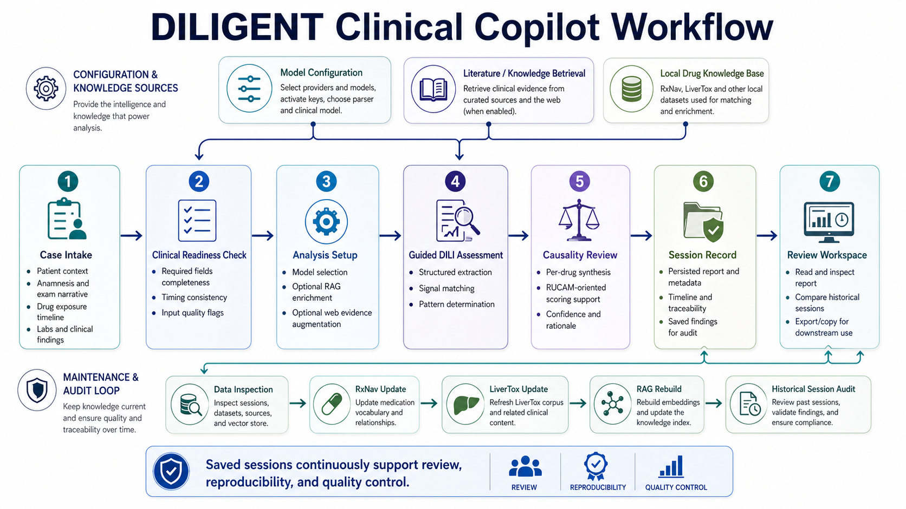
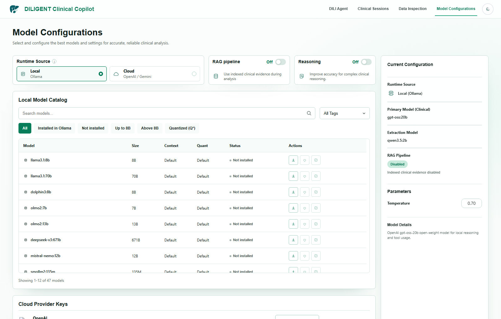

# DILIGENT Clinical Copilot

[](https://github.com/CTCycle/DILIGENT-Clinical-Copilot/releases) [](./app/server/pyproject.toml) [](./app/client/package.json) [](./LICENSE) [](https://github.com/CTCycle/DILIGENT-Clinical-Copilot/actions/workflows/ci.yml)

## 1. Project Overview
DILIGENT Clinical Copilot supports clinicians during Drug-Induced Liver Injury (DILI) evaluations with a FastAPI backend and an Angular + TypeScript frontend. It collects anamnesis, medications, and lab values, then coordinates clinical analysis with optional RAG support and session persistence for review.

> **Work in Progress**: This project is under active development and may contain incomplete features or defects.


_Conceptual flow from case intake through guided DILI analysis, session recording, and review._

## 2. Quick Start

### 2.1 Windows (Recommended)
Run:
```cmd
start_on_windows.bat
```

The launcher prepares local runtimes and dependencies, then starts the backend and frontend on the configured local ports.

### 2.2 macOS / Linux (Manual)
Prerequisites:
- Python 3.14+
- Node.js 18+ and npm

Backend:
```bash
cd app/server
python -m pip install -e ".[test]"
uvicorn app:app --host 127.0.0.1 --port 7690
```

Frontend:
```bash
cd app/client
npm install
npm run build
npm run preview -- --host 127.0.0.1 --port 9847 --strictPort
```

Default local endpoints:
- UI: `http://127.0.0.1:9847`
- API health: `http://127.0.0.1:7690/api/health`

## 3. Runtime Profiles
DILIGENT is configuration-first and uses one active runtime file: `settings/.env`.

The current deployment posture is explicit local single-user operation. Network production deployment without authentication is unsupported; runtime validation rejects non-local deployment modes until access-control work is added.

Switch to local profile:
```cmd
copy /Y settings\.env.local.example settings\.env
```

Switch to local Tauri profile:
```cmd
copy /Y settings\.env.local.tauri.example settings\.env
```

See `assets/docs/runtime/modes.md` for full runtime and packaging details.

Clinical job execution is process-local. Persisted clinical sessions remain durable, but in-memory job ids are not durable across backend restarts.

## 4. Using the Application
Typical workflow:
1. Enter anamnesis, exam notes, medications, and lab values.
2. Choose model/provider settings and optionally enable RAG/web search.
3. Run analysis and review the generated report.
4. Use Data Inspection to explore current knowledge base.
5. Explore past sessions and apply manual report edits.

Detailed user journeys and feature guidance are documented in `assets/docs/user/getting_started.md`, `assets/docs/user/dili_assessment_workflow.md`, and `assets/docs/user/sessions_timeline_and_data.md`.

### Screenshots

#### Dashboard / Report Output

_Clinical intake workspace with structured patient input, visit metadata, and report actions._

#### Sessions overview

_Clinical Sessions workspace with the persisted review layout shown and sensitive case content blurred._

#### Model Configuration (Settings)

_Runtime source, local model catalog, and active reasoning pipeline settings._

#### Data Inspection

_Catalog inspection view for curated drug records, update status, and maintenance actions._

## 5. Desktop Packaging (Tauri)
The desktop shell lives in `app/src-tauri`, while the frontend stays in `app/client`.

Versioned desktop content in `app/src-tauri` is limited to source code, configuration, icons, capabilities, and required build metadata such as `Cargo.toml`, `Cargo.lock`, `build.rs`, and `tauri.conf.json`.

Build Windows desktop artifacts:
```cmd
release\tauri\build_with_tauri.bat
```

Generated outputs:
- `release/windows/installers`
- `release/windows/portable`

Generated desktop outputs are not committed to Git. Keep `app/src-tauri/target`, `app/src-tauri/bundle`, `app/src-tauri/gen`, and packaged desktop binaries or archives out of the repository.

Desktop binaries such as `.exe` installers are published as release artifacts, not tracked in the repository. The packaged Windows release currently exports an NSIS `.exe` installer under `release/windows/installers`.

## 6. Setup and Maintenance
Run:
```cmd
setup_and_maintenance.bat
```

Use this script for offline maintenance operations (for example DB initialization and cleanup tasks).

### 6.1 Regression Validation Shortcuts

From repository root:

```cmd
app\tests\run_tests.bat modelconfig
app\tests\run_tests.bat modelconfigfull
```

- `modelconfig`: validated regression slice (model-config unit + focused model-config/app-flow e2e checks, including conflict-feedback handling)
- `modelconfigfull`: model-config unit + full `test_app_flow.py` + `test_model_config_api.py`
  - If `uv --with pytest-playwright` cannot access package indexes on first use, run the PowerShell runner directly after cache warmup.

Equivalent PowerShell runners:

```powershell
.\app\tests\run_model_config_regression.ps1
.\app\tests\run_model_config_full_regression.ps1
```

## 7. Database and Ollama Requirements
- Database schemas are not upgraded in place across this cleanup; recreate the schema (or local SQLite DB file) when upgrading.
- Runtime startup does not perform SQLite schema salvage/deletion.
- Ollama must support the chat-capable `/api/chat` API; `/api/generate` fallback behavior has been removed.

## 8. Documentation Map
- `assets/docs/project_index.md`: entry point for the documentation tree.
- `assets/docs/architecture/system_overview.md`: repository layout and system boundaries.
- `assets/docs/architecture/background_jobs.md`: job lifecycle and semantics.
- `assets/docs/runtime/modes.md`: runtime profiles and packaging.
- `assets/docs/coding/error_handling.md`: backend and frontend error strategy.
- `assets/docs/ui/components_and_patterns.md`: frontend structure and interface patterns.

## 9. License
Non-commercial use is covered by the Polyform Noncommercial License 1.0.0; commercial licensing is available separately. See `LICENSE`.


