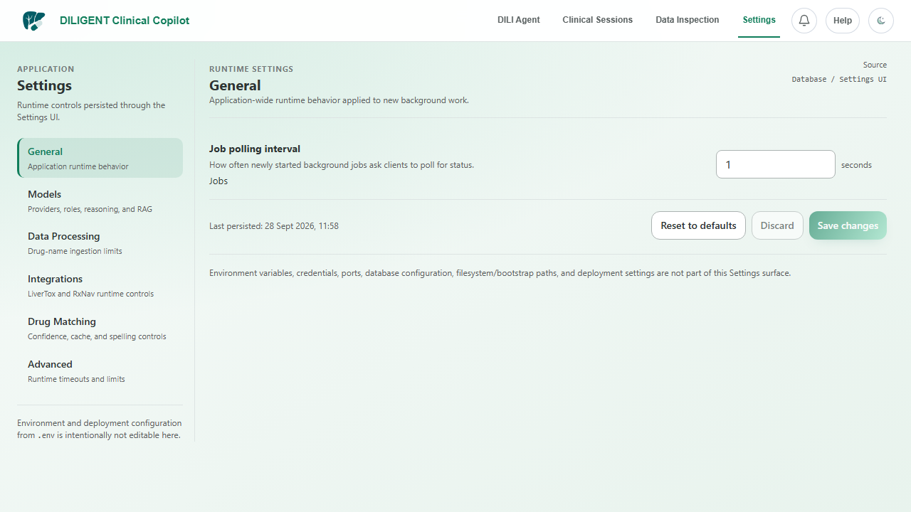
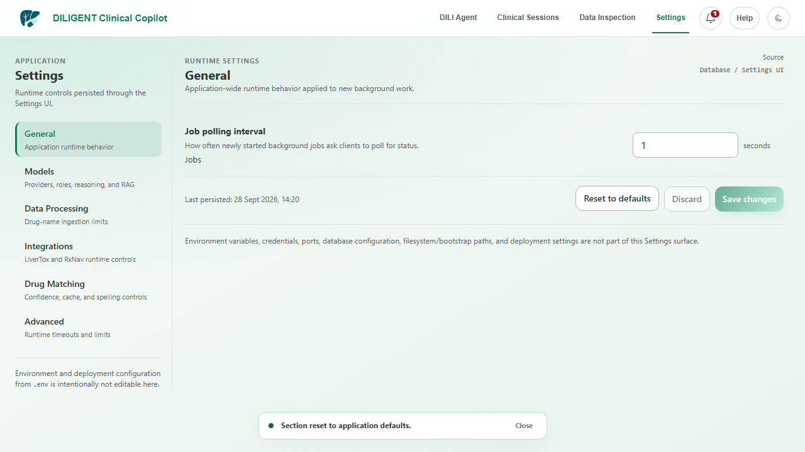
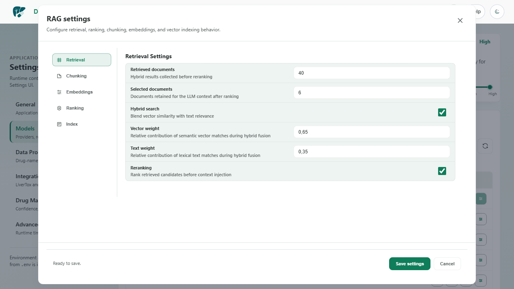

# Runtime settings migration and current-tree regression validation

Last updated: 2026-09-28

Date: 2026-09-28
Baseline: `c09c1291b2372343930fd902cf4dca59739bd967` (`develop`, equal to
`origin/develop` before the evidence-only documentation changes)

## Scope

This follow-up selected the current implementation slice introduced by the
runtime-configuration migration:

- database-backed Settings API and typed SQLite persistence;
- rendered Settings and Models/RAG surfaces;
- save, reload, reset, and legacy-settings-file boundaries;
- model-configuration API compatibility; and
- current backend, frontend, static-analysis, and build regression coverage.

The revision lifecycle was rechecked as an adjacent compatibility gate because
the migration changes runtime configuration consumed by revision and model
services. Provider-key, approved-credential, NCBI refresh, duplicate-file
policy, spoken screen-reader, container, and desktop-release gates remain
independent.

## Validation evidence

### Automated current-tree checks

| Check | Result |
|---|---|
| Backend unit and persistence suites (`app/tests/unit`, `app/tests/persistence`) | **824 passed, 14 skipped**, 9 warnings, 68.25 seconds |
| Runtime-settings/model-config focused unit suite | **65 passed**, 2 dependency warnings |
| Revision/runtime/API focused suite | **53 passed**, 2 dependency warnings |
| Model-configuration API E2E | **5 passed** |
| Settings/navigation Browser E2E slice | **4 passed**, 21 deselected |
| Angular/Vitest suite | **24 files, 105 tests passed** |
| Angular production build | **Passed**; application bundle generated |
| Ruff (`app/server`, `app/tests`) | **Passed**; protected-cache access warnings were non-failing filesystem warnings |
| Pyright (`app/server`) | **0 errors, 0 warnings, 0 informations** |
| `git diff --check` | **Passed** |

The backend warnings were existing dependency/deprecation warnings from
`google.genai`, Starlette/httpx, AnyIO, and SQLite datetime adapters. The 14
skips are the repository's documented conditional tests; they are not promoted
to passes.

### Isolated runtime/API persistence

A clone of the current SQLite database was used under this QA directory, with
the current backend on port `7692` and the current static frontend on `9849`.
The shared database and provider caches were not mutated.

- `GET /api/settings` returned `source=database`, `environment_editable=false`,
  the five typed categories (`general`, `data`, `integrations`, `matching`,
  `advanced`), and a persisted `updated_at`.
- The General Settings UI changed polling interval `1 -> 2`, saved it, retained
  `2` after a page reload, reset it to typed default `1`, and the API confirmed
  the database value was `1.0` after reset.
- The exact model-config API slice passed without catalog refresh and restored
  its temporary reasoning-level mutation in a `finally` path.
- `settings/configurations.json` was absent and the desktop runtime payload did
  not reference the legacy file.

### Rendered UI evidence

The official launcher started the current source build successfully on the
standard ports and returned backend health `200`. The in-app CUA browser
surface timed out during discovery twice; because that browser tool was
unavailable, the repository's bundled Playwright runtime was used as the
documented fallback for rendered verification.

The 1280x720 Settings surface visibly showed the Database / Settings UI source,
typed controls, left navigation, and Reset/Discard/Save actions. The Models
surface visibly opened the RAG settings modal with Retrieval, Chunking,
Embeddings, Ranking, and Index navigation. No console errors or failed network
requests were observed.

## Final gate disposition

| Gate | Final status | Evidence boundary and remaining limitation |
|---|---|---|
| `settings.runtime-model-configuration` | `VALIDATED` | Current database-backed Settings, model-config compatibility, typed persistence, reload, reset, legacy-file removal, rendered UI, frontend suite, backend suite, and build passed. Access-key material remains a separate blocked gate. |
| `ui.application-shell` | `VALIDATED` for the exercised scope | Current Settings/Models surfaces rendered at 1280x720 with no console/request failures. Spoken Narrator/Speech Recap output remains unvalidated. |
| `api.local-boundaries` | `WORKING` for the exercised settings/model-config scope | Settings and model-config routes passed; the complete 68-path response/error and mutating-route matrix remains outside this slice. |
| `revision.agentic-lifecycle` | `PARTIAL` | Current 53-test revision/runtime/API regression remains green after the configuration migration. Fresh live-provider acceptance, true process-restart recovery, injected tool-failure coverage beyond existing provider/invalid-tool cases, broader model variance, and every lifecycle branch remain open. |
| `test.automated-regression` | `PARTIAL` | Current local backend, frontend, static-analysis, and build gates passed. Hosted live-provider, conditional browser prerequisites, and a hosted run for this exact commit remain separate. |
| `model.provider.opencode-go` | `PARTIAL` | No approved `OPENCODE_GO_API_KEY` was present in the local process, so no current cloud request was made. |
| `auth.access-key-management` | `BLOCKED` | No approved disposable credential was available or mutated. |
| `data.inspection.catalogs` / `data.sources.refresh` | `PARTIAL` | The current LiverTox upstream human-verification blocker remains independent. |
| `rag.ingestion-retrieval` | `VALIDATED` for its existing expanded local boundary | Duplicate-file policy and fresh provider-backed vector execution remain outside scope. |
| `release.desktop.v3-4-0` | `BLOCKED` | Signed/tagged, hosted packaging, clean-machine, and publication prerequisites remain separate. |

## Defects and cleanup

No application source defect was found, so no product-code fix was required.
Task-owned cloned databases, logs, pytest caches, generated bytecode, and local
servers were removed after capture. The three rendered PNGs and this report are
the retained QA evidence. Ports `7690`, `7692`, `9847`, and `9849` were checked
offline after cleanup.
