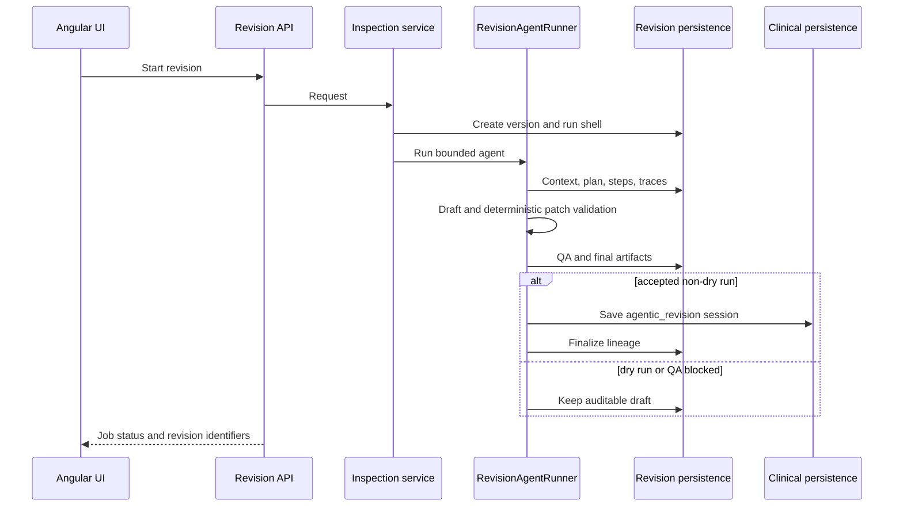

# API Surface
Last updated: 2026-08-20

`/api/model-config` manages provider, model, reasoning, and RAG selection; it
does not expose sampling temperature. `GET` returns the rich catalog and
runtime-status view. `PUT` is a persistence-only response containing the
saved configuration and timestamp; catalog and embedding refreshes remain
explicit GET/status operations.

## Stable Boundary
All business APIs are mounted under `/api`. The frontend uses `/api` as the stable frontend-backend boundary.

## Root and OpenAPI Routes
- `GET /`
- `GET /docs`
- `GET /redoc`
- `GET /openapi.json`

## Session And Clinical Routes
- `GET /api/health`
- `GET /api/clinical/section-template`
- `POST /api/clinical/validate-input`
- `POST /api/clinical/jobs`
- `GET /api/clinical/jobs/{job_id}`
- `DELETE /api/clinical/jobs/{job_id}`

`POST /api/clinical/validate-input` includes optional `rag_readiness` metadata when evaluating a submission. It reports whether RAG was requested, whether the configured embedding backend is available, the backend and model names, and a user-safe reason when retrieval cannot start.

## Model Catalog And Pull Routes
- `GET /api/models/list`
- `POST /api/models/pull/jobs`
- `GET /api/models/jobs/{job_id}`
- `DELETE /api/models/jobs/{job_id}`

## Model Configuration Routes
- `GET /api/model-config`
- `PUT /api/model-config`
- `POST /api/model-config/catalogs/{provider}/load`
- `POST /api/model-config/catalogs/{provider}/refresh`
- `GET /api/model-config/embedding-status`
- `POST /api/model-config/connectivity-check`

`GET /api/model-config` returns each cloud provider's model catalog together with
freshness status and a user-safe message. Catalogs are refreshed through the
provider's official model-list API; a successful in-process result is returned
as `cached` if a later refresh fails. Successful and failed catalog attempts are
persisted in the SQLAlchemy-backed provider catalog cache, so cached catalog
state survives a backend restart.
If a persisted model is no longer present in its provider's refreshed catalog,
the GET response still returns that saved selection together with the current
catalog so clients can present a valid replacement. Catalog membership remains
strictly validated when a new provider or model selection is saved. Responses
are non-cacheable so model selectors and their Retry actions always observe the
latest saved configuration and provider-catalog state.

## Access Key Routes
- `GET /api/access-keys?provider={openai|gemini|deepseek|anthropic|opencode|brave}`
- `POST /api/access-keys`
- `PUT /api/access-keys/{key_id}/activate`
- `DELETE /api/access-keys/{key_id}`

## Inspection Routes
- `GET /api/inspection/jobs`
- `GET /api/inspection/sessions`
- `GET /api/inspection/sessions/{session_id}`
- `GET /api/inspection/sessions/{session_id}/versions`
- `GET /api/inspection/sessions/{session_id}/versions/{version_id}`
- `PUT /api/inspection/sessions/{session_id}`
- `PUT /api/inspection/sessions/{session_id}/report`
- `GET /api/inspection/sessions/{session_id}/manual-edits`
- `POST /api/inspection/sessions/{session_id}/revision/jobs`
- `GET /api/inspection/sessions/revision/pipeline-runs/{pipeline_run_id}`
- `POST /api/inspection/sessions/revision/pipeline-runs/{pipeline_run_id}/retry`
- `GET /api/inspection/sessions/revision/pipeline-runs/{pipeline_run_id}/steps`
- `PUT /api/inspection/sessions/{session_id}/versions/{version_id}/clinical-review`
- `GET /api/inspection/sessions/revision/jobs/{job_id}`
- `DELETE /api/inspection/sessions/revision/jobs/{job_id}`
- `GET /api/inspection/sessions/{session_id}/versions/{version_id}/entities`
- `GET /api/inspection/sessions/{session_id}/versions/{version_id}/reviews`
- `GET /api/inspection/sessions/{session_id}/versions/{version_id}/artifacts`
- `GET /api/inspection/sessions/{session_id}/timelines`
- `GET /api/inspection/sessions/{session_id}/timelines/{timeline_id}`
- `DELETE /api/inspection/sessions/{session_id}/timelines/{timeline_id}`
- `POST /api/inspection/sessions/{session_id}/timeline-jobs`
- `GET /api/inspection/sessions/{session_id}/timeline-jobs/{job_id}`
- `DELETE /api/inspection/sessions/{session_id}/timeline-jobs/{job_id}`
- `DELETE /api/inspection/sessions/{session_id}`
- `GET /api/inspection/rxnav`
- `GET /api/inspection/rxnav/{drug_id}/aliases`
- `DELETE /api/inspection/rxnav/{drug_id}`
- `GET /api/inspection/rxnav/update-config`
- `POST /api/inspection/rxnav/jobs`
- `GET /api/inspection/rxnav/jobs/{job_id}`
- `DELETE /api/inspection/rxnav/jobs/{job_id}`
- `GET /api/inspection/livertox`
- `GET /api/inspection/livertox/{drug_id}/excerpt`
- `DELETE /api/inspection/livertox/{drug_id}`
- `GET /api/inspection/livertox/update-config`
- `POST /api/inspection/livertox/jobs`
- `GET /api/inspection/livertox/jobs/{job_id}`
- `DELETE /api/inspection/livertox/jobs/{job_id}`
- `GET /api/inspection/reference-catalogs/runtime-observations`
- `GET /api/inspection/reference-catalogs/runtime-observations/{category}`
- `PUT /api/inspection/reference-catalogs/runtime-observations/{category}`
- `DELETE /api/inspection/reference-catalogs/runtime-observations/{category}/{term}`
- `GET /api/inspection/rag/update-config`
- `GET /api/inspection/rag/documents`
- `GET /api/inspection/rag/vector-store`
- `POST /api/inspection/rag/jobs`
- `GET /api/inspection/rag/jobs/{job_id}`
- `DELETE /api/inspection/rag/jobs/{job_id}`

## Notes
- `POST /api/inspection/sessions/{session_id}/timeline-jobs` accepts optional run-scoped
  `model_overrides` and returns a job for polling. Local runs require `text_extraction_model`; cloud runs require
  `llm_provider` and `cloud_model`. These settings are applied only for that run and
  do not change persisted session settings or global model configuration. Timeline
  previews include source-evidence, missing-evidence, uncertain, and undated counts.
- Timeline deletion is scoped by both session and timeline identifiers and returns 404
  when that exact persisted timeline does not exist.
- Clinical and inspection workflows rely on job polling for long-running work.
  Angular feature trackers use the shared `JobPollingService`; the old
  duplicate polling helper in `clinical-api.ts` is no longer part of the
  client surface.
- Revision jobs expose the implemented bounded revision workflow: start and
  status, persisted run/context/plan/step/tool-trace/artifact reads, draft
  report validation, QA, optional `agentic_revision` session creation, and
  lineage/review reads. Dry runs and QA-blocked runs retain an auditable draft;
  an accepted non-dry run finalizes the revision lineage.
- Research has no active route inventory in the current architecture source and should not be documented as an active API surface until implemented.

### Session revision agent
`POST /api/inspection/sessions/{session_id}/revision/jobs` starts an agentic
revision job. Existing status, cancellation, pipeline-run, step, artifact,
entity, and clinical-review routes remain stable. The job returns
revision/version identifiers and task, tool, QA, and human-review summaries.

