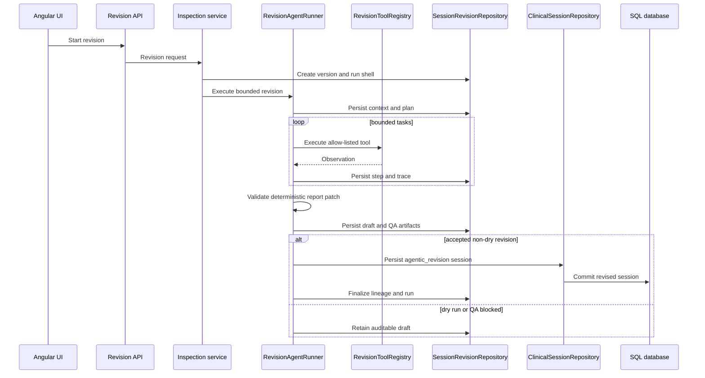

# Persistence
Last updated: 2026-08-20

## Relational Database

- SQLAlchemy-backed storage.
- Database mode and connection settings are sourced from `settings/.env`.
- SQLite uses `<resource-root>/database.db` when `database.embedded_database=true`; the source-mode resource root defaults to `app/resources` and can be overridden with `DILIGENT_RESOURCES_PATH`. PostgreSQL is used in external database mode.

## Relational Model

The relational schema keeps clinical sessions, immutable revision lineage,
knowledge/catalog data, configuration, and access keys in one SQLAlchemy
metadata graph. Vector documents remain in LanceDB and are intentionally not
foreign-keyed into this schema.

```mermaid
erDiagram
    CLINICAL_SESSIONS {
        int id PK
        string patient_name
        datetime session_timestamp
        string session_status
        string session_kind
    }
    CLINICAL_SESSION_RESULTS {
        int id PK
        int session_id FK
        json payload_json
    }
    CLINICAL_SESSION_SECTIONS {
        int id PK
        int session_id FK
        string section_kind
        text content
    }
    CLINICAL_SESSION_TIMELINES {
        int id PK
        int session_id FK
        datetime generated_at
        string generation_status
        json timeline_payload_json
    }
    CLINICAL_LAB_OBSERVATIONS {
        int id PK
        int session_id FK
        string marker_name
        float value
        date sample_date
    }
    CLINICAL_DRUG_MENTIONS {
        int id PK
        int session_id FK
        int drug_id FK
        int mention_ordinal
        string raw_mention
        string match_status
    }
    CLINICAL_SESSION_VERSIONS {
        int id PK
        int session_id FK
        int root_session_id FK
        int source_version_id FK
        int version_number
        string revision_kind
        string version_status
    }
    CLINICAL_SESSION_REVISION_RUNS {
        int id PK
        string pipeline_run_id UK
        int session_id FK
        int source_version_id FK
        int target_revision_version_id FK
        string status
    }
    CLINICAL_SESSION_REVISION_STEPS {
        int id PK
        int run_id FK
        string pipeline_run_id
        string step_name
        int attempt
        string status
    }
    CLINICAL_SESSION_REVISION_ARTIFACTS {
        int id PK
        int run_id FK
        int revision_version_id FK
        string artifact_key
        string status
    }
    CLINICAL_SESSION_REVISION_REVIEWS {
        int id PK
        int revision_version_id FK
        int session_id FK
        string review_status
    }
    DRUGS {
        int id PK
        string canonical_name
        string canonical_name_norm
    }
    DRUG_RXNORM_CODES {
        int id PK
        int drug_id FK
        string rxcui UK
    }
    DRUG_ALIASES {
        int id PK
        int drug_id FK
        string alias
    }
    DRUG_IDENTIFIERS {
        int id PK
        int drug_id FK
        string identifier_system
        string identifier_value
    }
    LIVERTOX_MONOGRAPHS {
        int id PK
        int drug_id FK
        string monograph_key UK
    }
    KB_MATCH_CACHE {
        int id PK
        int drug_id FK
        string normalized_key
        string source
        float confidence
    }
    ACCESS_KEYS {
        int id PK
        string provider
        text encrypted_value
        boolean is_active
        string fingerprint
    }
    APPLICATION_CONFIGURATION {
        int id PK
        int revision
        json payload
    }
    PROVIDER_MODEL_CATALOG_CACHE {
        string provider_id PK
        string configuration_fingerprint
        json models
    }
    REFERENCE_CATALOG_ENTRIES {
        int id PK
        string manifest
        int manifest_version
        string domain
        string category
        string key
    }
    REFERENCE_CATALOG_MANIFESTS {
        int id PK
        string manifest UK
        int installed_version
        string manifest_hash
    }

    CLINICAL_SESSIONS ||--o| CLINICAL_SESSION_RESULTS : result
    CLINICAL_SESSIONS ||--o{ CLINICAL_SESSION_SECTIONS : sections
    CLINICAL_SESSIONS ||--o{ CLINICAL_SESSION_TIMELINES : timelines
    CLINICAL_SESSIONS ||--o{ CLINICAL_LAB_OBSERVATIONS : labs
    CLINICAL_SESSIONS ||--o{ CLINICAL_DRUG_MENTIONS : mentions
    CLINICAL_SESSIONS ||--o{ CLINICAL_SESSION_VERSIONS : versions
    CLINICAL_SESSION_VERSIONS o|--o{ CLINICAL_SESSION_VERSIONS : source_version
    CLINICAL_SESSIONS ||--o{ CLINICAL_SESSION_REVISION_RUNS : runs
    CLINICAL_SESSION_VERSIONS o|--o{ CLINICAL_SESSION_REVISION_RUNS : source
    CLINICAL_SESSION_VERSIONS o|--o{ CLINICAL_SESSION_REVISION_RUNS : target
    CLINICAL_SESSION_REVISION_RUNS o|--o{ CLINICAL_SESSION_REVISION_STEPS : steps
    CLINICAL_SESSION_REVISION_RUNS o|--o{ CLINICAL_SESSION_REVISION_ARTIFACTS : artifacts
    CLINICAL_SESSION_VERSIONS ||--o{ CLINICAL_SESSION_REVISION_ARTIFACTS : version_artifacts
    CLINICAL_SESSION_VERSIONS ||--o{ CLINICAL_SESSION_REVISION_REVIEWS : reviews
    CLINICAL_SESSIONS o|--o{ CLINICAL_SESSION_REVISION_REVIEWS : session_reviews
    DRUGS ||--o{ DRUG_RXNORM_CODES : rxnorm
    DRUGS ||--o{ DRUG_ALIASES : aliases
    DRUGS ||--o{ DRUG_IDENTIFIERS : identifiers
    DRUGS ||--o{ LIVERTOX_MONOGRAPHS : monographs
    DRUGS o|--o{ KB_MATCH_CACHE : cached_matches
    DRUGS o|--o{ CLINICAL_DRUG_MENTIONS : resolves
```

## Persisted Clinical Session Contract

- `clinical_sessions` is the source of truth for session records and metadata.
- `clinical_session_versions` owns immutable version lineage, root-session relationships, version numbers, and manual edits.
- Revision tables own the bounded revision workflow and canonical artifacts:
  `clinical_session_versions`, `clinical_session_revision_runs`,
  `clinical_session_revision_steps`, `clinical_session_revision_artifacts`,
  and `clinical_session_revision_reviews`.
- Structured revision entities are stored as `structured_case_entity` rows in `clinical_session_revision_artifacts`.
- Manual report edits create immutable `clinical_session_versions` rows with `revision_kind=manual_edit`.
- Patient timeline history is persisted only in `clinical_session_timelines`; session result payloads are not a timeline read source.
- Timeline generation metadata stays on persisted timeline records and does not rewrite original clinical-session runtime metadata.
- Evidence-locked DILI artifacts in the database-backed session result payload are `normalized_document`, `extraction_artifact`, `fact_graph`, `faithfulness_audit`, generated report metadata, discrepancy report, and `dili_evidence_bundle_index`.
- Successful clinical workflows require persistence. Repository failures, missing persisted IDs, and failed upserts are service dependency failures rather than silent in-memory success.
- SQLite enables foreign keys, a 30-second busy timeout, and WAL journaling.
- Alembic is the authoritative schema-evolution mechanism. The shared
  `repositories.schemas.Base.metadata` is the autogenerate source of truth;
  application startup and explicit initialization never use `create_all()`.
- Startup and installation serialize migration attempts, inspect the current
  Alembic head, and apply pending revisions before repositories or services run.
- Unversioned v2.4-v3.0 databases are adopted through the released baseline and
  upgraded without dropping data. Unversioned current-schema databases are
  stamped only after an exact metadata comparison; unknown schemas are rejected.
- SQLAlchemy update timestamps use an application-level update hook shared by SQLite and PostgreSQL.
- Version listing and detail reads are side-effect-free; synchronization is reserved for explicit write paths.
- Durable loose JSON or Markdown assessment files are not part of the runtime contract.
- Canonical repeated observations are stored in `clinical_lab_observations` and ordered drug mentions in `clinical_drug_mentions`.
- Access-key ciphertext remains in the database; versioned Fernet key material is stored in the protected `DILIGENT_ACCESS_KEY_MATERIAL_FILE` store.
- Canonical drug identifiers use `drug_identifiers` with unique `(identifier_system, identifier_value)` ownership.
- `application_configuration` is the fixed-ID singleton for validated configuration payloads, and `reference_catalog_manifests` records installed manifest state.

## Focused Repository Ownership

- `KnowledgeRepository` owns evidence data.
- `DrugCatalogRepository` owns RxNav data.
- `ClinicalSessionRepository` owns session-result persistence.
- `SessionTimelineRepository` owns timeline rows.
- `SessionRevisionRepository` owns revision data, steps, and artifacts.
- `ClinicalKnowledgePreparation` is the application-level coordinator for
  drug-identity resolution, runtime vocabulary observations, and knowledge
  match-cache updates. `ClinicalSessionRepository` persists resolved drug
  mentions and does not learn catalog aliases while saving a session.
- `DataInspectionService` coordinates cross-repository inspection responses;
  it combines clinical session detail with revision records rather than making
  either repository depend on the other.
- Feature-specific file serialization remains separate from SQLAlchemy persistence. `RepositoryContext` supplies the shared engine/session factory, and application services receive only the focused repositories they need. Transactions remain explicit at the repository boundary, including atomic session persistence and batch ingestion.
- `repositories/serialization` is a mixed historical package: pure row and
  payload converters remain there, but access-key and model-configuration
  adapters also own SQLAlchemy queries, transactions, and commits. Public
  access-key operations return `AccessKeyRecord`; ORM rows remain internal to
  persistence and encryption code.

## Reference Catalog Persistence

- Canonical manifests live in `app/resources/catalogs/*.json` and are seeded into database tables.
- RxNorm persistence uses `drug_rxnorm_codes` as the canonical RxCUI mapping table.
- Explicit database initialization seeds the canonical manifests after Alembic
  reaches head.
- SQLite startup creates the configured `.db` when missing, migrates it, and
  seeds once. Existing SQLite files are migrated but not reseeded.
- PostgreSQL startup connects to the configured database, creates it when the
  configured credentials permit creation, migrates it, and seeds only a newly
  created database. Existing databases are not reset or reseeded during normal
  startup.
- Full reseed or reset remains explicit through `app/scripts/initialize_database.py --drop-existing --seed-catalogs --force-reseed-catalogs`.

## Vector Persistence

- LanceDB collections live under `app/resources/sources/vectors`.
- RAG uses the immutable Granite embedding contract in `common/embedding/config.py`; index generations carry a versioned manifest and exact embedding fingerprint.

## Filesystem Resources

- In development, `app/resources/sources` contains source catalogs, documents, archives, vectors, models, and logs.
- In packaged desktop mode, immutable catalogs and Angular assets live under the extracted runtime; databases, logs, models, source documents, vectors, exports, state, and access-key material live under `%LOCALAPPDATA%\DILIGENT\data`.
- `app/resources/catalogs` contains JSON seed manifests for database-backed reference catalogs and is copied to the immutable packaged runtime.

The extracted runtime is versioned and hash-addressed so it can be replaced during upgrades. The persistent data root is intentionally outside the runtime and is not removed by desktop artifact cleanup or MSI uninstall.

## Access Key Persistence

- Encrypted provider keys are persisted in database tables.
- Provider-scoped retrieval filters by both provider and key ID.
- The persistence constraint covers OpenAI, Gemini, DeepSeek, Anthropic, OpenCode, and Brave.

## Persistence Contract Validation

- `app/tests/persistence` runs against file-backed SQLite.
- When `TEST_DATABASE_URL` is configured, the same contract runs against PostgreSQL.
- CI runs both backends in the `persistence-contract` job.

## Model Configuration Persistence

- A newly initialized database receives canonical model defaults.
- Existing provider and model selections are read as stored; unsupported values fail validation and are not silently translated.
- Provider model catalogs are persisted in `provider_model_catalog_cache`, keyed by provider and a fingerprint of the catalog endpoint plus the active credential (or normalized Ollama endpoint). Secrets are never stored.
- `GET /api/model-config` reads cached catalog state only. The provider-specific `load` operation contacts a provider only for a cold cache, while `refresh` is the explicit replacement operation.
- Failed attempts are persisted with sanitized metadata. A failed cloud refresh preserves the last valid list; an empty Ollama installation is a valid cached result. Endpoint or active-key changes invalidate the old scope without affecting inactive credentials.
- The same SQLAlchemy schema is initialized for development and packaged desktop runtimes, so the persisted catalog survives navigation and application restarts without startup polling.

## Agentic Revision Artifacts

Revision runs persist bounded context, plan, tool traces, draft reports, QA,
and finalization artifacts. Successful non-dry runs create an
`agentic_revision` session and attach it to the pre-created version shell; QA
blockers persist as `qa_failed` drafts for human review.

