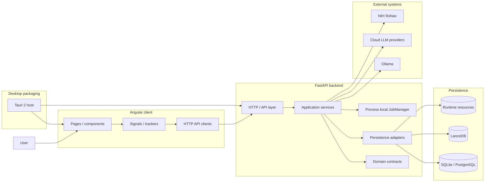

# System Overview
Last updated: 2026-08-20

## System Summary
DILIGENT is a local-first clinical application with:
- FastAPI backend in `app/server`
- Angular standalone frontend in `app/client`
- PowerShell launcher and maintenance menu in `start_on_windows.ps1`
- Isolated Windows desktop release project under `app/desktop`

Primary flow:
1. The user submits clinical data in the Angular UI.
2. The backend validates and normalizes the input, then runs clinical analysis.
3. Long-running work executes through background jobs with poll and cancel APIs.
4. Results, catalogs, and session data are persisted for later review.

## Runtime Topology

DILIGENT is a modular monolith. The desktop shell, Angular client, FastAPI
application, and persistence adapters are packaged together for local use;
there is no runtime microservice boundary or message broker.



## Repository Structure
Maintained source-level structure, with build and cache artifacts omitted:

```text
.
|-- start_on_windows.ps1
|-- settings/
|   |-- .env
|   |-- .env.example
|   `-- configurations.json
|-- app/
|   |-- resources/
|   |   |-- catalogs/
|   |   |-- models/
|   |   |-- logs/
|   |   `-- sources/
|   |-- server/
|   |   |-- app.py
|   |   |-- api/
|   |   |-- configurations/
|   |   |-- domain/
|   |   |-- repositories/
|   |   |   |-- schemas/clinical.py
|   |   |   |-- schemas/knowledge.py
|   |   |   |-- schemas/security.py
|   |   |   `-- schemas/configuration.py
|   |   |-- services/
|   |   |-- common/
|   |   |   |-- catalogs/
|   |   |   |   |-- provider.py
|   |   |   |   |-- manifest_loader.py
|   |   |   |-- utils/
|   |   |   |-- security/
|   |   |   |-- prompts/
|   |-- client/
|   |   |-- package.json
|   |   |-- src/
|   |   |   |-- main.ts
|   |   |   |-- styles.scss
|   |   |   `-- app/
|   |   |       |-- app.ts
|   |   |       |-- app.routes.ts
|   |   |       |-- core/
|   |   |       |-- components/
|   |   |       `-- pages/
|   `-- tests/
|       |-- run_tests.bat
|       |-- conftest.py
|       |-- unit/
|       `-- e2e/
|-- app/desktop/
|   |-- build/                 # runtime payload and PyInstaller inputs
|   `-- src-tauri/             # Tauri shell, backend lifecycle, and extraction
`-- assets/docs/
    |-- architecture/
    |-- coding/
    |-- runtime/
    |-- ui/
    `-- user/
```

## Application Entry Points
- Backend app: `app/server/app.py`
  - Builds the FastAPI app through `create_app()`, initializes settings, registers middleware and error handlers, mounts routers under `/api`, and runs startup checks through the FastAPI lifespan path.
- Frontend app: `app/client/src/main.ts`
  - Bootstraps Angular `App` with `appConfig`.
- Frontend routing: `app/client/src/app/app.routes.ts`
- Current routes: `/`, `/clinical-sessions`, `/data`, `/model-config`, `/sessions/:sessionId/timetable`, and `/sessions/:sessionId/timetable/:timelineId`.
- Windows launcher and maintenance entry point: `start_on_windows.ps1`.

### Runtime entry points

- Development: `start_on_windows.ps1` starts Uvicorn and the Angular preview server on the configured development ports.
- Packaged desktop: the Tauri shell in `app/desktop/src-tauri` extracts a verified runtime, starts `DILIGENTBackend.exe` on a random localhost port, and loads the Angular build served by FastAPI. Node.js is not part of the packaged runtime.

The release pipeline produces a no-install portable EXE, an MSI, and a SHA-256 manifest. The EXE and MSI share the same embedded deterministic runtime archive; the shell keeps mutable user data outside that archive under `%LOCALAPPDATA%\DILIGENT\data`.

The tag-triggered `.github/workflows/release.yml` rebuilds both Windows artifacts from the release tag and attaches the portable EXE and MSI to the matching GitHub Release.

Backend ownership is explicit: API endpoints call services, services
orchestrate domain contracts, and focused repositories own persistence.
`ClinicalKnowledgePreparation` coordinates cross-repository drug resolution and
runtime vocabulary learning before and after `ClinicalSessionRepository`
persists already-resolved mentions. `DataInspectionService` coordinates the
session and revision repositories for inspection responses. Repository helpers
are not all pure serializers: `access_keys.py` and model-configuration adapters
own SQL sessions and transactions, while other helpers remain pure row or value
converters. The deterministic `ExposureTimelineService` and explicitly
injected Hepatox subservices remain independent of the HTTP layer. The local
database is recreated with
`app/scripts/initialize_database.py --drop-existing --seed-catalogs --force-reseed-catalogs`
when a clean schema cutover is required.
