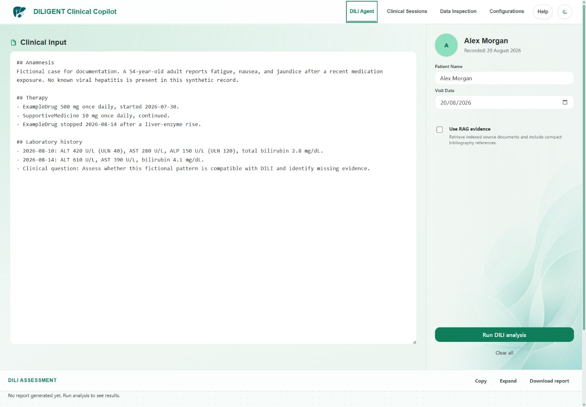

# DILI Assessment Workflow
Last updated: 2026-08-31

## Open The DILI Agent
Open **DILI Agent** from the sidebar.

This is the main assessment page. It collects clinical context and submits a structured request to the backend analysis endpoint.



_DILI Agent with synthetic input prepared for a review._

Typical input areas include:
- patient identifier or case identifier
- patient age or demographics
- suspected medication or exposure
- clinical history
- laboratory values
- symptoms
- timing information
- notes or free-text clinical context
- optional file upload where enabled
- run or submit action
- generated assessment output

On a first empty assessment, the page may show a small optional **Get started with DILI Agent** callout. Use **Show me** for the four-step tour of clinical input, patient name/date, RAG evidence, and review/run, or use **Open Configurations** to choose a runtime and the four role models. The tour can be closed with its X button and reopened from header **Help**.

## Enter Clinical Context
Use clear, specific, structured text. Prefer input like:

```text
Patient: 54-year-old adult
Suspected medication: ExampleDrug
Exposure timing: Started 21 days before liver enzyme rise
Labs: ALT 820, AST 610, ALP 160, total bilirubin 3.2
Symptoms: fatigue, jaundice
Relevant negatives: no known viral hepatitis in available records
Clinical question: assess whether this pattern is compatible with DILI
```

Avoid vague input like:

```text
Patient has liver issue. Check DILI.
```

## Run The Assessment
1. Review the entered information.
2. Confirm the selected model configuration.
3. Select the run or submit action.
4. The application completes all pre-flight checks before starting backend processing or model calls.
5. If blocking issues are listed, return to the input panel and correct them before retrying.
6. If only warnings are listed, either return to update the input or explicitly continue with the stated limitations.
7. If RAG is unavailable, continuing applies a no-RAG fallback only to the pending assessment. The saved RAG preference is unchanged.
8. Wait for the progress indicator to finish. DILI runs can take a long time;
   the browser request timeout is one hour and does not cancel the background
   job.
9. You may navigate to another page and return to the DILI Agent during the
   same browser session; the in-memory page state remains available. A full
   refresh or closing and reopening the browser intentionally resets unsaved
   clinical input and does not reattach the DILI page to an active job. The
   backend job may continue independently, but use **Clinical Sessions** to
   review work after it has been persisted.

Expected result:
- the application submits structured clinical input to the backend
- the backend uses the configured provider and model
- the UI shows a generated DILI assessment or a clear error message

Choosing **Run without RAG** affects only the pending assessment. It does not disable the saved RAG configuration for future sessions.

The **Use RAG evidence** checkbox is deliberately per-assessment. **Configurations** controls the retrieval and reranking setup; the checkbox decides whether this run requests indexed evidence. If the pre-flight check reports that RAG is unavailable, continuing applies the fallback only to that pending assessment.

During Step 12, the progress message identifies whether vector retrieval is
enabled. If evidence preparation exceeds its bounded runtime, the assessment
continues without that prepared evidence and reports a warning for review.

If the run fails:
- confirm backend health
- confirm model provider configuration is saved
- confirm an active access key exists if required
- confirm Ollama is running for local Ollama models
- review backend console output for structured errors

## Review The Generated Report
Treat the report as a decision-support draft, not a final diagnosis.

Review for:
- consistency between exposure timeline and reported interpretation
- correct interpretation of liver chemistry pattern
- mention of confounders and alternative causes
- consistency between conclusion and supplied evidence
- unsupported assumptions or invented facts
- drug-resolution review flags for ambiguous, missing, or unvalidated RxNav/LiverTox matches
- explicit missing-data statements rather than silent negatives
- the twelve acceptance-question answers and their supporting quotes

The main report is a readable clinical DILI evaluation with per-drug narrative
commentary and a concise deterministic adjudication summary. The full structured
DILI dossier is retained as an audit artifact in the session result payload and
should be used to verify the clinical narrative before reuse.

The structured dossier explicitly reports:
- longitudinal exposure and lab timeline events
- dose changes, restart or rechallenge mentions, and dechallenge direction
- Hy's Law state and why it is or is not met
- competing-cause states as `excluded`, `not_excluded`, `unknown`, or `missing_data`
- supportive RUCAM component evidence
- DILIN-like overall causality reasoning

Drug matching statuses can include:
- `accepted_exact_livertox`
- `accepted_rxnav_validated`
- `accepted_livertox_without_rxnav`
- `ambiguous_requires_review`
- `missing_rxnav`
- `missing_livertox`
- `rejected_false_positive`

Ambiguous matches require review and are not treated as authoritative LiverTox evidence. A LiverTox excerpt indicates available monograph text, not automatic proof that the drug identity is clinically correct.

If the report is incomplete or wrong:
1. Add missing clinical details.
2. Correct the input.
3. Re-run the assessment.
4. Compare the new output with the previous one.

## Copy Or Export Output
Use the available copy or export controls to move the report into the local workflow.

Before reusing output:
- verify dates
- verify lab values and units
- verify drug names and dosing
- remove placeholders and unsupported statements
- add human reviewer attribution according to local policy
