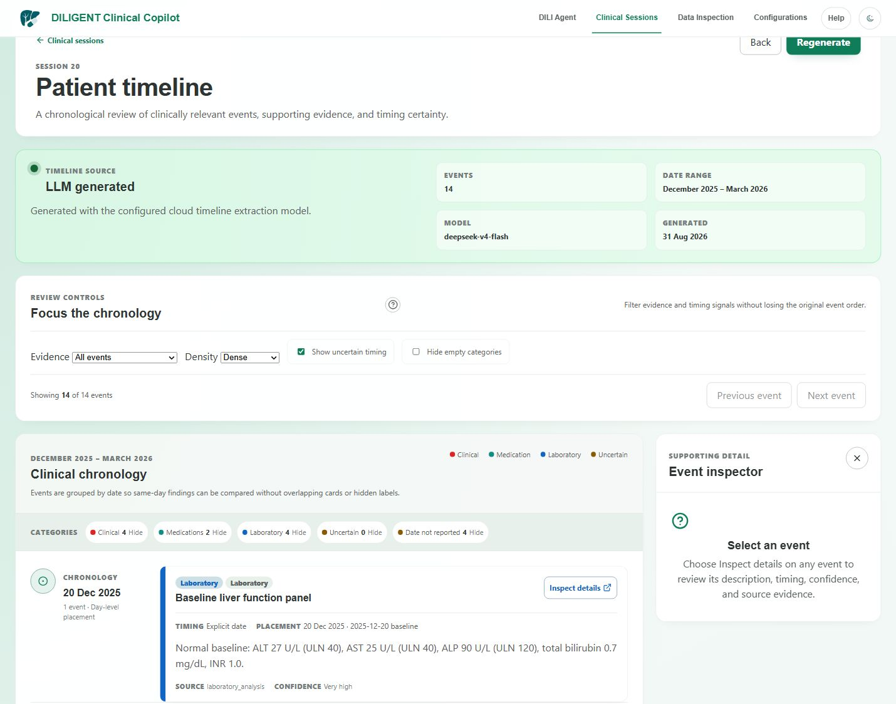
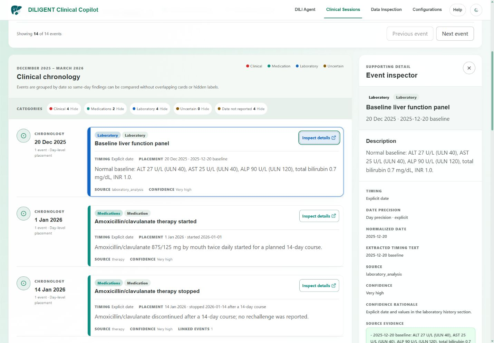
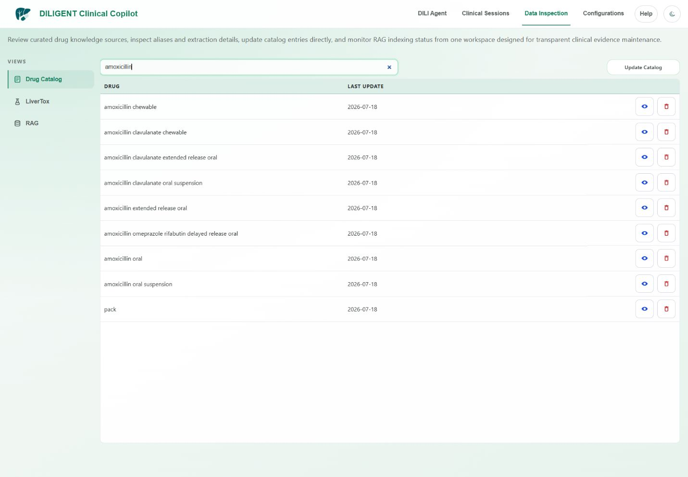

# Sessions, Timeline, And Data
Last updated: 2026-09-10

## Inspect Saved Clinical Sessions
Open **Clinical Sessions** from the sidebar.

The selected session's tabs have contextual help that changes with the selected page:
**Preview** is read-only, **Text Editor** saves manual edits, **Metadata** stores
attached evidence and JSON, **Revision** creates a new draft, and **Timeline**
manages generated chronologies.

Expected capabilities:
- view a list of sessions
- select a session
- review session metadata
- review generated content
- filter or refresh records where supported

Recommended workflow:
1. Open **Clinical Sessions**.
2. Locate the target session by identifier, date, or metadata.
3. Select the session.
4. Use **Text Editor** for direct in-place manual report edits.
   The Source view preserves Markdown, whitespace, blank lines, and unsaved drafts while Rendered shows a read-only preview of that same draft. Save persists the source text directly.
5. Use **LLM Revision** to create a new draft revision version when a model-assisted rewrite is needed.
6. Use **Official Version History** to inspect version lineage separately from **Manual Edit History**.
7. Use **Version Comparison** to compare the selected official version against its source or another persisted official version using backend-computed entity and report diffs.
8. Use **Human Clinical Review** to mark a revision version `under_review`, `approved_by_human`, or `rejected_by_human`.
9. Review **Revision QA And Artifacts**, **Revision Consultation Provenance**, **Revision Finalization Provenance**, **Persisted Revision Entities**, and persisted pipeline steps before approving an LLM-assisted revision.

If a session is missing, confirm that the assessment completed successfully and that local persistence is initialized.

Important distinctions:
- Manual report edits do not create a new official version.
- LLM-assisted revision creates a new versioned draft and keeps the previous version unchanged.
- Human clinical review status is separate from LLM QA status.
- Backend-provided matched drugs, structured case fields, revision entities, RxNav identifiers, LiverTox matches, and linked FDA DILIrank identifiers are authoritative persisted evidence only within their documented source semantics.
- A DILIrank category is a drug-level hepatotoxicity prior, not a patient-level causality score.
- Frontend-derived display fallbacks are labeled as **Display fallback** or **Not backend-confirmed**. These values are navigation aids only and must not be interpreted as RxNav, LiverTox, DILIrank, RUCAM, or backend-confirmed clinical evidence.

## Use Patient Timeline from a session
Select a session in **Clinical Sessions**, then open its **Timeline** tab. Saved timeline previews open at `/sessions/:sessionId/timetable/:timelineId`; the route without `:timelineId` starts from the session workspace. There is no separate Patient Timeline item in the primary sidebar.

Use it to review event order, clinical sequence, and patient chronology where data is available.



_Patient Timeline review controls and the first complete chronology event._

Recommended workflow:
1. Open **Clinical Sessions**.
2. Locate and select the relevant patient or case.
3. Open the session's **Timeline** tab.
4. Generate a new timeline when needed from the session timeline workspace.
5. Reopen any previously generated timeline from the saved timeline preview list instead of regenerating it.
6. Review timeline entries in chronological order.
7. Compare exposure dates against lab abnormalities and symptoms.
8. Use the timeline to refine DILI Agent input if needed.

In the **Timeline** tab, the generation action uses the model assigned to the
Timeline role in **Configurations**. Use **Manage model roles** when that
assignment needs to change. Saved timelines appear as compact rows that record
the run's provider, model, date range, event count, and evidence-quality
warnings. Use **Open** to reopen a specific saved timeline or **Delete** to
remove only that saved timeline after confirmation.

The timetable presents a vertical chronology grouped by canonical date so events on
the same day remain readable without overlapping cards. Clinical, Medication,
Laboratory, Uncertain, and Date not reported categories remain explicit through
labels and category controls. Use its evidence filter, category collapse controls,
dense/compact/comfortable density, and previous/next navigation to focus review.
Selecting an event opens the desktop Event inspector. Approximate placement, a **Fallback chronology**, and **Missing
source evidence** are visible warnings, not clinical confirmation.



_Event inspector with timing, confidence, and source evidence for a synthetic laboratory event._

Use the help popover beside **Review controls** when the filter names need context. Evidence filters describe source support, density changes reading comfort, uncertain timing keeps approximate events visible, and **Inspect details** opens the event's source and confidence rationale. These controls do not alter the saved timeline.

Timeline generation may show a fallback notice when model extraction does not complete. For an explicitly selected OpenCode Go model, a temporary model-catalog outage does not prevent the known routed request from being attempted. The notice now identifies the failure class, such as provider network unavailable, provider timeout, authentication rejected, rate limited, upstream error, invalid structured response, or incomplete configuration. Transient network, timeout, rate-limit, and upstream failures are retried with bounded backoff before fallback. In that case, the timetable is built deterministically from persisted session fields with uncertain timing and no invented exact dates. Treat fallback events as navigation aids rather than model-extracted chronology, then retry after correcting the reported condition.

For LLM-generated timelines, events without preserved source evidence are not part of the persisted clinical chronology contract. In the UI, missing source evidence should be treated as a warning rather than as clinically grounded support.

## Inspect Local Data
Open **Data Inspection** from the sidebar.



_Data Inspection filtered to public catalog records._

Expected capabilities:
- resource or table selection for RxNav, LiverTox, FDA DILIrank 2.0, and RAG
- refresh controls
- record counts or metadata
- table-style inspection
- search, filter, or pagination where supported
- embedding or resource update status where supported

The **DILIrank** view is read-only. It shows FDA compound name, linked canonical drug when a safe deterministic link exists, LTKB ID, DILI concern class, severity class, labeling section, and source comment. `Unlinked` is an intentional state: it means the FDA row is preserved but is not eligible to contribute to clinical consultation. Do not infer a missing mapping manually from display similarity.

Recommended workflow:
1. Open **Data Inspection**.
2. Select the resource or dataset.
3. Refresh the view.
4. Confirm expected records are present.
5. Use filters or pagination to inspect specific records.
6. For DILIrank, distinguish linked records from preserved unlinked source rows before interpreting the clinical knowledge available for a drug.

Do not edit local database files manually while the application is running.

## Update Local Resources
Some resources or embeddings may require initialization or refresh through the Data Inspection update controls or through:

```text
start_on_windows.ps1
```

DILIrank updates use the official FDA workbook. The default update may reuse a validated local workbook while checking HTTP freshness metadata; **Download fresh source** forces a new download. A downloaded candidate is validated before it replaces the last-known-good cache.

Use the launcher menu options for database initialization, dependency maintenance, test execution, log cleanup, or cache cleanup when those broader maintenance operations are needed.

Expected result:
- progress is reported
- long-running jobs show status
- refreshed resources become available after completion
- restarting the application after maintenance is recommended